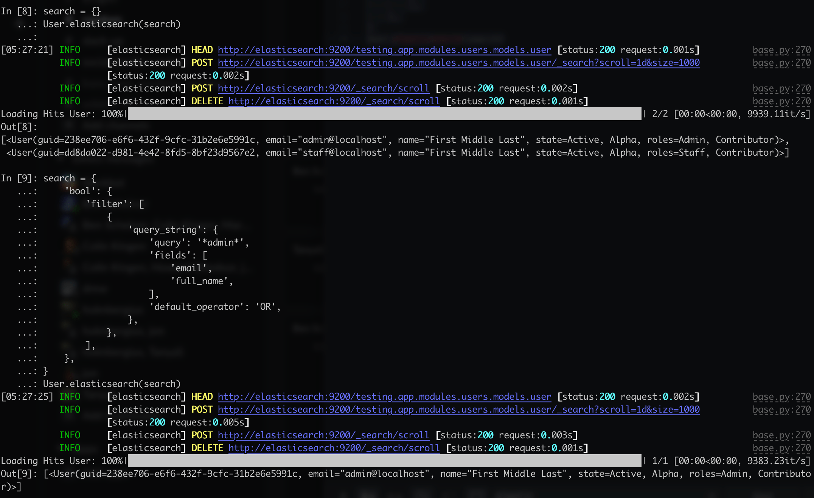
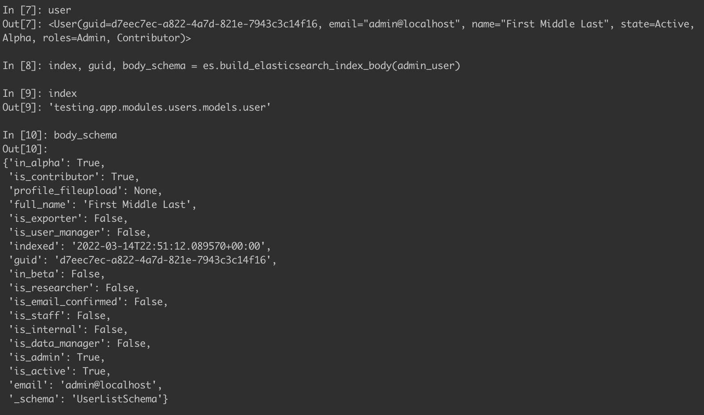
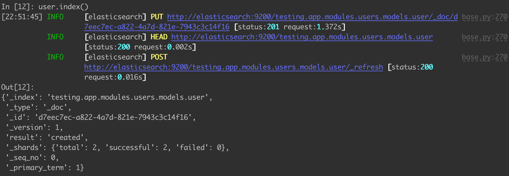
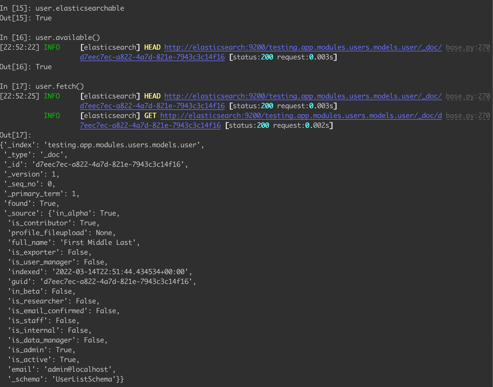
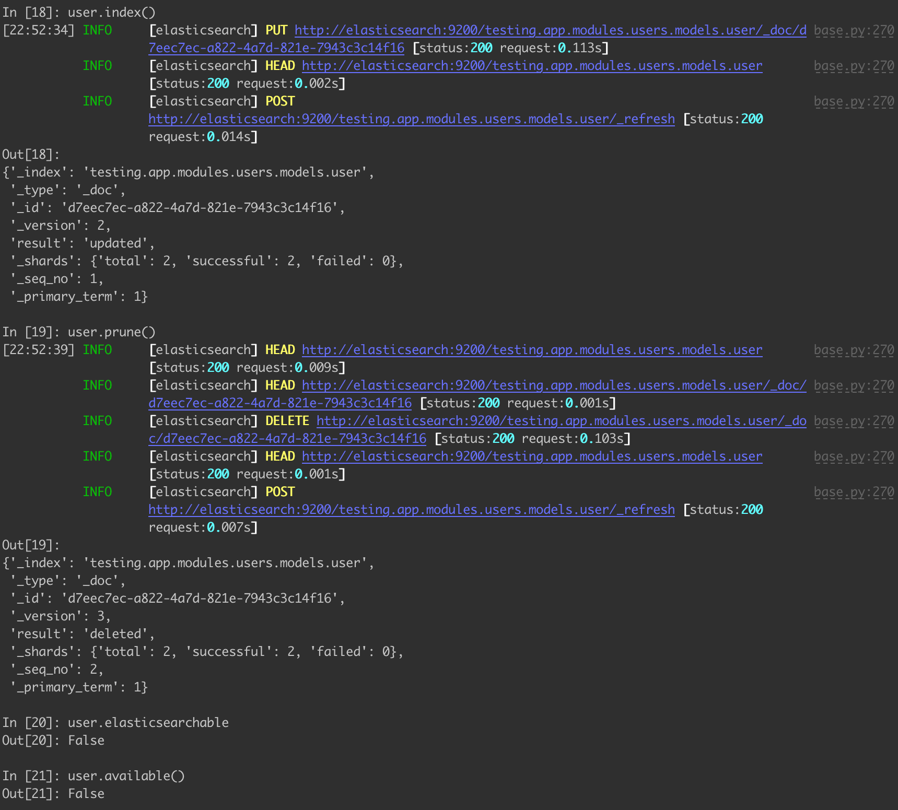
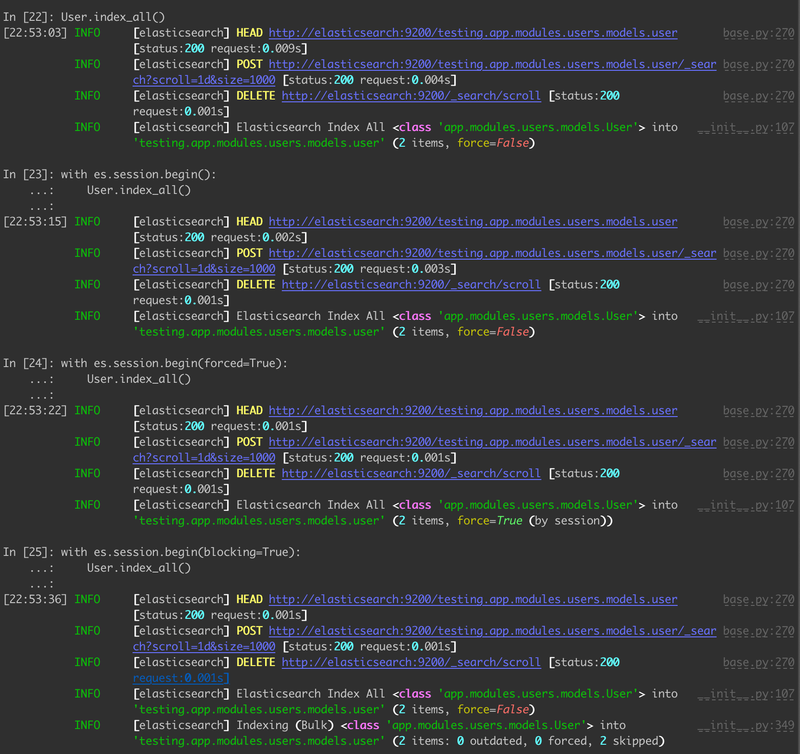
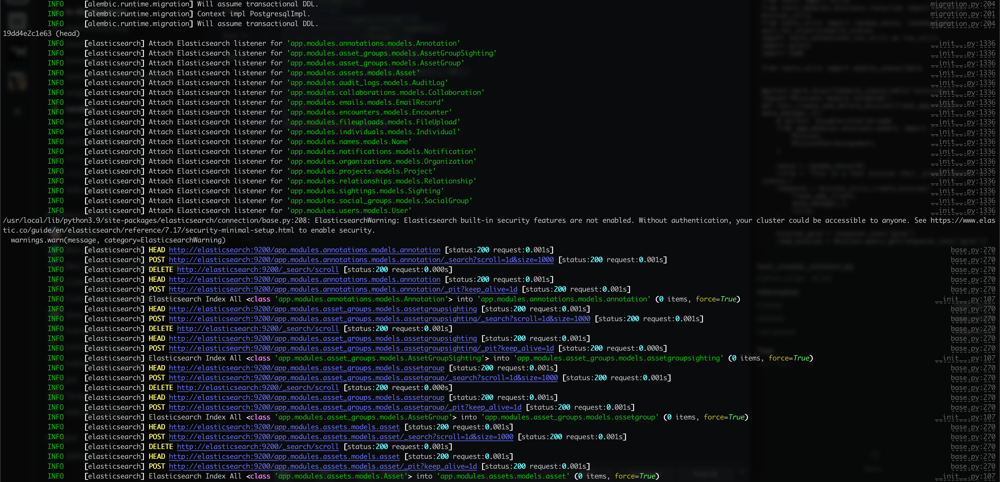
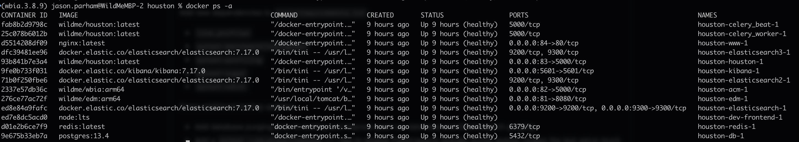

# Overview

Houston supports Elasticsearch, with automatic and explicit definitions of schemas.  You may add Elasticsearch support to an existing model with `app.extensions.register_elasticsearch_model`, which registers the specified model with the automatic Elasticsearch indexing.  The name of each index is derived automatically from the location of the registered model.  For example, the `app.modules.users.models.User` model is automatically given the index name `app.modules.users.models.user` without any further input from the user.

``` python
from app.extensions import register_elasticsearch_model

def init_app(app, **kwargs):
    from . import models
    register_elasticsearch_model(models.User)
```

The following `HoustonModels` now support indexing and searching with Elasticsearch:
- `Annotation`
- `AssetGroup`
- `AssetGroupSighting`
- `Asset`
- `AuditLog`
- `Collaboration`
- `EmailRecord`
- `Encounter`
- `FileUpload`
- `Individual`
- `Integrity`
- `Mission`
- `MissionCollection`
- `MissionTask`
- `Name`
- `Notification`
- `Organization`
- `Project`
- `Relationship`
- `Sighting`
- `SocialGroup`
- `User`

# Usage

For all registered objects, the primary entry point for using Elasticsearch is `objs = cls.elasticsearch(body)`.  This function will search a class with the provided Elasticsearch body and will ALWAYS return objects for that class.  To retrieve all results out of Elasticsearch, use `body=None` or `body={}`.  When the results from Elasticsearch are returned, we receive only a list of GUIDs that match the given query.  All GUIDs are then checked against the local Houston database.  If the GUID does not exist in the local database, it is automatically pruned out of Elasticsearch.  If the GUID exists in the database, the objects are loaded from the local Houston database.  We do not rely on the cached copy in Elasticsearch, we always use Elasticsearch to resolve GUIDs for a given class and then load the objects fresh out of the Houston DB.

The `cls.elasticsearch()` function also takes in an additional `load=False` parameter which will return a list of GUIDs instead of a list of objects.  The benefit of this is that it is extremely fast to manipulate lists of GUIDs.  When loading is turned off during Elasticsearch, the API will still guarantee that the GUIDs exist in the local database, it simply skips the costly step of loading those objects into memory from the database.



Note: This API does not support Elasticsearch-based sorting or paging.  Any sorting or pagination arguments passed to Elasticsearch are ignored.  All sorting and pagination are performed by Houston and support Houston model attributes.

# Supported Serialization Schemas

All registered models are serialized automatically unless a schema is specified.  The `get_elasticsearch_schema()` function can be used to tell Elasticsearch how to serialize an object and is defined for the following models:
- `Annotation` -> `DetailedAnnotationSchema`
- `AssetGroup` -> `CreateAssetGroupSchema`
- `AssetGroupSighting` -> `BaseAssetGroupSightingSchema`
- `Asset` -> `DetailedAssetTableSchema`
- `AuditLog` -> `DetailedAuditLogSchema`
- `Collaboration` -> `DetailedCollaborationSchema`
- `EmailRecord` -> `BaseEmailRecordSchema`
- `Encounter` -> `ElasticsearchEncounterSchema`
- `FileUpload` -> `DetailedFileUploadSchema`
- `Individual` -> `ElasticsearchSightingSchema`
- `Integrity` -> `BaseIntegritySchema`
- `Mission` -> `DetailedMissionSchema`
- `MissionCollection` -> `CreateMissionCollectionSchema`
- `MissionTask` -> `BaseMissionTaskTableSchema`
- `Name` -> `DetailedNameSchema`
- `Notification` -> `BaseNotificationSchema`
- `Organization` -> `DetailedOrganizationSchema`
- `Project` -> `BaseProjectSchema`
- `Relationship` -> `DetailedRelationshipSchema`
- `Sighting` -> `ElasticsearchSightingSchema`
- `SocialGroup` -> `DetailedSocialGroupSchema`
- `User` -> `UserListSchema`

The Elasticsearch extension will dynamically walk over an object and look for JSON serializable attributes if a schema is not specified.  This automatic parsing supports all build-in JSON types and adds support for `datetime.datetime` and `uuid.UUID`.

# Database Models

All of the existing FeatureModels inherit from `ElasticsearchModel`.  In addition, all `FeatherModels` now support an `indexed` timestamp and an `elasticsearchable` flag to know if a given model is searchable in Elasticsearch.

``` python
class ElasticsearchModel(object):
    
    @classmethod
    def _index(cls, ...):
        # Returns the name of the class' index

    def get_elasticsearch_schema(cls, ...):
        # Returns the schema used to serialize the class for Elasticsearch
        # If unspecified, the Elasticsearch extension will automatically parse an object

    def index_hook_cls(cls, ...):
        # A hook called when a class is indexed

    #######################################################

    def pit(cls, ...):
        # Establish a "Point in Time" to base all searching off of

    def elasticsearch(cls, ...):
        # Search a class with elasticsearch
        # Returns a list of objects for this class.

    #######################################################

    def index_all(cls, ...):
        # Index all objects for this class

    def prune_all(cls, ...):
        # Prune (delete) all objects for this class

    def invalidate_all(cls, ...):
        # Invalidate (force a future index refresh) all objects for this class

    #######################################################
    @property
    def index_name(self, ...):
        # Returns the index used for this object

    @property
    def elasticsearchable(self, ...):
        # Returns True if the object has been indexed since it was last updated in the Houston DB

    #######################################################

    def index_hook_obj(self, ...):
        # A hook called when an object is indexed, calls `cls.index_hook_cls(self.__class__)` by default
    
    #######################################################

    def available(self, ...):
        # Returns True if the object is in Elasticsearch

    def index(self, ...):
        # Indexes the object into Elasticsearch

    def fetch(self, ...):
        # Retrieve the current serialized information for this object currently in Elasticsearch

    def prune(self, ...):
        # Prune (delete) the object out of Elasticsearch

    def invalidate(self, ...):
        # Invalidate (force a future index refresh) the object

    def validate(self, ...):
        # Validate (update the indexed timestamp) the object

    def serlaize(self, ...):
        # Serialize (convert to JSON) the object using the defined schema (or automatic)
```

# Serializing Objects



# Indexing Objects



# Fetching Objects



# Pruning Objects



# Elasticsearch Extension Features

``` python
from app.extensions import elasticsearch as es

# Turn Elasticsearch off globally
es.off()

# Turn Elasticsearch on globally (on by default if the extension is enabled)
es.on()

# Returns True if Elasticsearch is disabled (off)
es.is_disabled()

# Returns True if Elasticsearch is enabled (on)
es.is_enabled()

#######################################################

# Check the status of the background celery tasks in use by Elasticsearch
# This call will automatically clean up any jobs that have finished and restart any jobs that have failed
# The `revoke=True` argument will shutdown all active jobs
es.check_celery()

# Get the status of Elasticsearch.
# Will return the number of objects that are out of date, and the number of active background tasks
es.es_status()

# Wait for the status of Elasticsearch to catch up, then continue
es.es_checkpoint()

#######################################################

# Get the index name from a registered class
# For example, `index = 'app.modules.users.models.user'`
index = es.es_index_name(cls)

# Check if a given index exists, returns True if so
es.es_index_exists(index)

# Get the mappings for a given index, returns {} if not found
es.es_index_mappings(index)

# Delete a given index by name
es.es_delete_index(index)

# Refresh (force all items to be available for searching) a given index 
es.es_refresh_index(index)

#######################################################

# Build the serialization body for an object (don't call directly, used by functions below)
# Additional argument `allow_schema=False` which will force automatic serialization
index, guid, body = es.es_serialize(obj)

# Check if an object exists in Elasticsearch
es.es_exists(obj)

# Index an object into Elasticsearch using `es.build_elasticsearch_index_body(obj)`
es.es_index(obj)

# An alias of `es.es_index(obj)`
es.es_add(obj)

# An alias of `es.es_index(obj)`
es.es_insert(obj)

# An alias of `es.es_index(obj)`
es.es_update(obj)

# Retrieve the serialized information for an object in Elasticsearch
es.es_get(obj)

# Retrieve the raw results for an index out of Elasticsearch
results = es.es_search(index, body)

# Delete an object out of Elasticsearch
es.es_delete(obj)

# Delete an item out of Elasticsearch using the class and GUID
es.es_delete_guid(cls, guid)

#######################################################

# Index all objects for all classes registered with Elasticsearch
es.es_index_all()

# Prune (delete) all objects for all classes registered with Elasticsearch
es.es_prune_all()

# Invalidate (force a future index refresh) all objects for all classes registered with Elasticsearch
es.es_invalidate_all()

# Refresh (force all items to be available for searching) all indices registered with Elasticsearch
es.es_refresh_all()
```

# Automatic Database Changes & Elasticsearch Sessions

By default, anytime a Houston DB object is added, modified, or deleted, we instantly update the Elasticsearch for that object if it is registered.  This happens automatically and does not require any additional code.  Furthermore, there is a new context manager to allow all changes to Elasticsearch to be done in bulk.  This is handy when large amounts of objects are changed in a single transaction and need to be sent to Elasticsearch.  Just as individual database changes are slow, the same is true when updating the Elasticsearch index one item at a time.

All `db.session.begin()` contexts automatically begin an Elasticsearch session.  A session may be started manually with the following code:

``` python 
from app.extensions import elasticsearch as es

with es.session.begin():
    # All changes to Elasticsearch are held in memory until the context ends
    # All changes are grouped by class and are applied in one large batch
```

The context manager supports nesting, resets on exceptions, and configuration.  Furthermore, the backend code will force any session to close if it has been open longer than `es.ELASTICSEARCH_MAXIMUM_SESSION_LENGTH` (defaults to 15 minutes).  For configuration, you may pass the following arguments to `es.session.begin()`:
- `blocking=True` - Forces the batch operation to happen in the foreground if background Celery jobs are enabled.
- `verify=True` - Forces the batch operation to complete before continuing (similar to `es.es_checkpoint()`).
- `forced=True` - Forces any touched object to index on the spot, ignoring if it wasn't modified since it was last indexed.



# Background Celery Updates & Configuration

Adding Elasticsearch to all database transactions adds about a 40% overhead during the automated testing.  Houston also supports background Celery workers to process all indexing operations to prevent this from being a performance hit with the production web server.  This happens automatically with each Elasticsearch session when the `app/extensions/elasticsearch` extension is enabled.  By default, all changes are done in batch and done in the background.

The base config supports the following new values:
- `ELASTICSEARCH_BLOCKING` - Defaults to False, which will perform all bulk Elasticsearch operations in the background (non-blocking)
- `ELASTICSEARCH_BUILD_INDEX_ON_STARTUP` - Defaults to False, which will re-build the entire Elasticsearch index for all registered models on start-up.  This happens in the background if `ELASTICSEARCH_BLOCKING` is False.

Furthermore, two additional background Celery tasks happen on a schedule:
 - `es_task_refresh_index_all` - Runs every hour to update any out-of-date objects in the database (which may happen if the on-demand updates fail for any reason).  The frequency can be specified with as `es.ELASTICSEARCH_UPDATE_FREQUENCY`
 - `es_task_invalidate_indexed_timestamps` - Runs every 12 hours to re-index the entire Elasticsearch index for all registered models (this ensures that all objects are continually refreshed at a known cadence and ensures any cruft in the index is automatically deleted).    The frequency can be specified with as `es.  ELASTICSEARCH_FIREWALL_FREQUENCY `

# REST APIs

We query Elasticsearch for matching results when provided a search body.  The response from Elasticsearch is a list of GUIDs and the results are sorted, paginated, and loaded from the Houston database directly.  While the contents of specific search results may be slightly outdated, the returned schemas are based on the local DB version of an object.  Furthermore, we pass Elasticsearch APIs errors back to the user as a `BAD_REQUEST` with the same error message.

You may search supported models with Elasticsearch using the APIs listed below:

``` python
- /api/v1/annotations/search
- /api/v1/asset_groups/search
- /api/v1/asset_groups/sighting/search
- /api/v1/assets/search
- /api/v1/audit_logs/search
- /api/v1/collaborations/search
- /api/v1/encounters/search
- /api/v1/individuals/search
- /api/v1/integrity/search
- /api/v1/missions/search
- /api/v1/missions/collections/search
- /api/v1/missions/tasks/search
- /api/v1/notifications/search
- /api/v1/organizations/search
- /api/v1/projects/search
- /api/v1/relationships/search
- /api/v1/sightings/search
- /api/v1/social-groups/search
- /api/v1/users/search
```

Additional APIs are available to interact with Elasticsearch as a service
- `[GET] /api/v1/search/` to list all of the available indes names in Elasticsearch
- `[GET] /api/v1/search/<index>/mappings` to list all available attributes in Elasticsearch
- `[GET] /api/v1/search/status` to list how outdated the Elasticsearch database is relative to Houston.  This API also shows the number of active background Celery jobs in use by Elasticsearch
- `[GET] /api/v1/search/sync` to force an Elasticsearch re-index on-demand.

# Pagination & List Filtering

The Elasticsearch APIs all support pagination, which has also been updated for all listing APIs for each module.  The pagination threshold has been increased from 20 to 100 and applied globally for all relevant modules.  All paginated APIs also now support sorting before paging.  In the event a tie is encountered during sorting, all results will be secondarily sorted by the primary key of the table.

``` python
class PaginationParameters(Parameters):
    """
    Helper Parameters class to reuse pagination.
    """

    limit = base_fields.Integer(
        description='limit a number of items (allowed range is 1-100), default is 100.',
        missing=100,
        validate=validate.Range(min=1, max=100),
    )
    offset = base_fields.Integer(
        description='a number of items to skip, default is 0.',
        missing=0,
        validate=validate.Range(min=0),
    )
    sort = base_fields.String(
        description='the field to sort the results by, default is the primary key column',
        missing='primary',
    )
    reverse = base_fields.Boolean(
        description='the field to reverse the sorted results (before paging has been performed), default is False',
        missing=False,
    )
    reverse_after = base_fields.Boolean(
        description='the field to reverse the sorted results (after paging has been performed), default is False',
        missing=False,
    )
    search = base_fields.String(
        description='the field to filter the results by a search string, not required',
        required=False,
    )
```

 Furthermore, all APIs now support a basic listing filter through a model's `query_search_term_hook(cls, term)` function.  This function is called automatically by the `@api.paginate()` decorator and will support basic attributes in the local Houston database. Again, this list filtering is NOT intended to replace Elasticsearch, but simply a way to provide some basic searching on GUIDs, etc.

``` python 
@classmethod
def query_search_term_hook(cls, term):
    from sqlalchemy_utils.functions import cast_if
    from sqlalchemy import String

    return (cast_if(cls.guid, String).contains(term),)
```

# Web Server Start-up

The logs will show the registered models and that the database listeners have been attached on start-up.  After this, the start-up will re-index the entire Houston database and (by default) ask Celery to update the index with fresh copies of all data.



# Docker Services

The Elasticsearch service uses multi-node setup and uses version 7.17.0.  Kibana is also available for visualizing / manipulating the index.  Flower is also available to visualize Celery (3 workers by default).



# Testing

When testing, all Elasticsearch index names are given a prefix of `testing.`.  This means that all of the index names for testing are disjoint from the main application, and the automated Celery tasks will not conflict when tests are running.

Testing utilities for:
- `prep_randomized_tus_dir()` to create a Tus test directory with random images (128 pixels by 128 pixels by RGB) with random noise
- `wait_for_elasticsearch_status()` to wait for Elaticsearch to catch up

The benchmarking of tests will automatically report all tests that take longer than 3 seconds.

``` bash
102.51s setup    tests/modules/encounters/resources/test_read_encounters.py::test_read_encounters[None-False]
# The setup time for this test includes the time to create the database and set up Elasticsearch
44.32s teardown tests/modules/social_groups/resources/test_social_group.py::test_individual_delete[None-False]
# This teardown time for this test includes the time to delete the database and purge Elasticsearch
39.92s call     tests/extensions/test_elasticsearch.py::test_elasticsearch_utilities[None-False]
24.41s call     tests/modules/individuals/resources/test_merge.py::test_get_data_and_voting[None-False]
16.33s call     tests/modules/users/resources/test_modifying_users_info.py::test_user_profile_fileupload[None-False]
15.07s call     tests/extensions/test_elasticsearch.py::test_model_search[None-False]
8.82s setup    tests/modules/test_elasticsearch_proxy.py::TestIndividualsSearchIndex::test_no_criteria[None-False]
8.33s call     tests/modules/individuals/test_merge.py::test_merge_names[None-False]
8.21s call     tests/modules/individuals/test_merge.py::test_failure_cases[None-False]
7.05s call     tests/modules/notifications/resources/test_notifications.py::test_notification_preferences[None-False]
6.87s setup    tests/modules/test_elasticsearch_proxy.py::TestIndividualsSearchIndex::test_with_body[None-False]
6.59s call     tests/modules/encounters/resources/test_modify_encounter.py::test_create_encounter_time_test[None-False]
5.59s call     tests/modules/individuals/resources/test_merge.py::test_merge_permissions[None-False]
5.49s call     tests/modules/auth/resources/test_general_access.py::test_created_user_login[None-False]
5.23s call     tests/modules/users/resources/test_signup.py::test_user_creation_deactivation_reactivation_user_manager[None-False]
4.46s call     tests/modules/individuals/resources/test_individual_names.py::test_get_set_individual_names[None-False]
4.36s call     tests/modules/individuals/resources/test_merge_conflicts.py::test_overrides[None-False]
3.97s call     tests/modules/individuals/resources/test_merge_conflicts.py::test_get_conflicts[None-False]
3.92s call     tests/modules/encounters/resources/test_modify_encounter.py::test_modify_encounter[None-False]
3.76s call     tests/modules/social_groups/resources/test_social_group.py::test_patch[None-False]
3.70s call     tests/modules/individuals/resources/test_merge.py::test_merge_basics[None-False]
3.50s call     tests/modules/sightings/resources/test_create_sighting.py::test_create_sighting_time_test[None-False]
3.36s call     tests/modules/sightings/resources/test_create_sighting.py::test_create_and_modify_and_delete_sighting[None-False]
3.34s call     tests/modules/asset_groups/resources/test_create_asset_group.py::test_create_bulk_asset_group[None-False]
3.27s call     tests/modules/audit_logs/resources/test_audit_log.py::test_audit_asset_group_creation[None-False]
3.27s call     tests/modules/social_groups/resources/test_social_group.py::test_individual_delete[None-False]
3.20s call     tests/modules/individuals/test_merge.py::test_merge_social_groups[None-False]
3.11s teardown tests/modules/individuals/test_merge.py::test_merge_names[None-False]
3.10s call     tests/modules/individuals/resources/test_individual_crud.py::test_add_remove_encounters[None-False]
3.08s call     tests/modules/asset_groups/resources/test_create_asset_group.py::test_create_asset_group_no_assets[None-False]
```

Lastly, a `pytest --no-elasticsearch` CLI flag to disable Elasticsearch globally during testing (makes the test setup much faster)


# Known Issues

### 1.  SYSCTL Resource Limits

``` Bash
ERROR: [1] bootstrap checks failed. You must address the points described in the following [1] lines before starting Elasticsearch.
bootstrap check failure [1] of [1]: max virtual memory areas vm.max_map_count [65530] is too low, increase to at least [262144]
ERROR: Elasticsearch did not exit normally - check the logs at /usr/share/elasticsearch/logs/docker-cluster.log
```

On Linux, the Docker service needs to be configured with more resources for Elasticsearch.  Add the following line to `/etc/sysctl.conf` and then reboot your Operating System:

``` text
vm.max_map_count=270000
```

Alternatively, you can apply this in real-time by running `sudo sysctl -w vm.max_map_count=270000`

### 2.  Houston DB Migration Failure

``` Bash
sqlalchemy.exc.ProgrammingError: (psycopg2.errors.UndefinedColumn) column houston_config.indexed does not exist
LINE 1: ...houston_config.updated AS houston_config_updated, houston_co...
```

When updating an existing database that has pre-existing `HoustonConfig` rows, you need to update the database manually prior to running `app.run`.    Perform the following:1. 2. Edit the `docker-compose.yml` file and update the Houston command to 

1. Stop all Docker services `docker-compose down`, repeat the command to ensure all services are deleted, not simply stopped
2. Edit the `docker-compose.yml` file and change the first few lines of the Houston service to look like this (remove the `depends_on` block and change the `command`):

``` Docker
  houston:
    # https://github.com/WildMeOrg/houston
    image: wildme/houston:latest
    build: &houston-build
      context: .
      target: main
    command: ["invoke", "app.db.upgrade"]
    healthcheck:
       ...
```

3. Start your Houston services with `docker-compose up db houston`
4. Once you see the line `houston-houston-1 exited with code 0`, stop the Houston service with `Ctrl-C` and then  `docker-compose down`
5. Revert all changes to your `docker-compose.yml` file.
6. Start the Docker services as normal with `docker-compose up`

### 3.  Partial Support for Attributes when Sorting

Sorting for all paginated APIs only supports attributes listed in the corresponding Houston model.  This is done during the SQL SELECT query for efficiency and does not support derived attributes.  This can be supported later but will likely be slow.  This may be accomplished by using a hybrid property in SQLAlchemy.  https://docs.sqlalchemy.org/en/14/orm/mapped_sql_expr.html#using-a-hybrid
