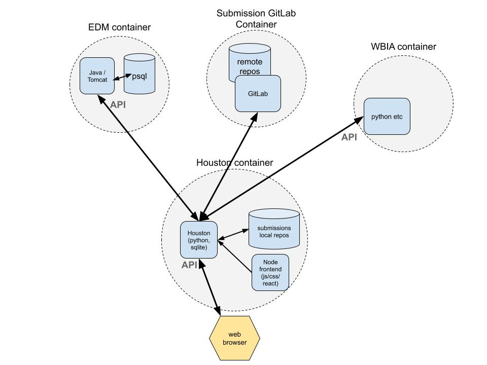

Houston is the controller of the Next Gen Wildbook. How the Houston code is to be used is well documented in the  <a href="https://github.com/WildbookOrg/houston"> README.md </a> file which will not be duplicated here. This page is a higher level overview of what Houston is trying to achieve; some basic concepts for those unfamiliar and a few things that tripped me up. 

Houston uses the <a href="https://restcookbook.com/"> REST</a> API interfaces into the EDM and WB-IA but is itself also a REST API implementation based on the <a href="https://flask-restplus.readthedocs.io/en/stable/"> Flask Rest API </a>.

## Python modules used by Houston
Houston uses a number of Python modules, most of which are use via derived classes in Jasons flask_restplus_patched code to integrate into the flask restplus framework. 
   - <a href="https://flask-sqlalchemy.palletsprojects.com/en/2.x/">flask SQLAlchemy</a> to abstract from the main code which database is used, could be Postgres or SQLLite. 
       - <a href="https://alembic.sqlalchemy.org/en/latest/">Alembic</a> Migration of SQLAlchemy database as new paramaters are added to the model.
   - <a href="https://flask-restplus.readthedocs.io/en/stable/api.html"> Flask REST API</a> Handles how the system interacts with the user.
     - <a href="https://swagger.io/docs/specification/about/">Swagger</a> provides a way to easily provide documentation for the REST API implemented.
     - <a href="https://marshmallow.readthedocs.io/en/stable/why.html">Marshmallow</a> Schemas to perform the conversion to/from the HTML representation of the data and the underlying database.
   
## Design overview
The design is split into :
   - app/modules : Components that have a database table associated with them and perform actions on that table.
   - app/extensions : Backend handlers 
       - For interaction with external components (edm, wbia). 
       - Can also be for module independant functionality (logging, security).
   - tasks : PyInvoke tasks. 
       - Tools that will be used by an adminstrator to manage the Wildbook.
       - Also useful for debugging.

## Houston Modules
Within each module the code is split into two logical blocks. The models.py manages what data is stored within the modules and the resources, parameters and schemas manage how this data is accessed via the REST API.
   - models.py : The definition of the database table for this module. 
       - Present in virtually all modules (not in passthrough)
       - Classes derive from the db.Model class in flask SQLAlchemy.
       - Classes also derive from one of :
           - HoustonModel : For objects that are stored persistently and mastered by Houston
           - FeatherModel : For objects that are stored persistently but mastered by something else e.g. EDM
           - GhostModel : For objects that are not stored persitently
   - resources.py : defines the actions that can performed on the database table via Rest API HTTP GET/POST/PATCH requests.
       - Present in virtually all modules (not in email, surely it will be <b><i>TBC</i></b>)
       - Classes derive from flask_restplus_patched Resource which is a derived Flask Resource class.
       - Along with the parameters and response, these also use api decorators to define the permission required to perform the request. 
   - schemas.py : Used to map between database format in db.Model and HTTP response.
       - Present in modules that have complex responses to requests.
       - Classes derive from Marshmallow Schema classes in the patched flask interface.
       - Used as api decorators by the resources.py methods to define the format of API responses.
   - parameters.py : Used to map between HTTP request format and the db.Model.
       - Present in modules that have complex requests.
       - Classes derive from Marshmallow Schema classes in the patched flask interface.
       - Used as api decorators by the resources.py methods to define the format of API request.

## Data availability within Houston
The full next gen wildbook system is as shown below

The data stored within Houston consists of :
   - The database model regarding what users, submissions, assets, sightings etc that are known about by Houston. 
        - This is expected to be a complete set at all times. Nothing will exist in the Wildbook that Houston is unaware of.
        - This data is stored within the `_db/database.sqlite3` file and is read by the app.run houston on startup.
   - The files associated with the submissions, images etc. 
       - The local houston is not expected to have access to all of these files at all times, just to know that they exist and can be cloned from the Submission Gitlab.
       - This is the "local repos" shown above and exists in the filesystem under the `_db/submissions` directory with a subdirectory for each submission.
       - On startup the app does not read these local files. They can be deleted to release storage.
       - The full submission assets are stored within the Submission GitLab. 
           - This allows testing (take a subset of submissions and use a test setup) 
           - And debugging (take a sequence of submissions and rerun to detect errors in EDM)
           
      - File data is stored within the Houston container for processing, either on the way in for submissions or on the way out for servicing requests. 
          - The file data in the houston container is transient. 

Non submission assets are stored in the `_db/Assets` directory. Nothing actually there yet.

## Data accessibility within Houston
The REST API allows access to the resources within Hoston but there needs to be management of who is permitted to access each resource. In this context a resource may be an asset, a sighting etc.

For all of the requests coming in to any of the module resources.py files, access is controlled by the modules/users/permissions code. Currently implemented is ObjectReadAccessPermission. This uses the user has_permission_to_read method which checks if the user has access itself or via a project the user is in.

The above functionality is all generic for all modules. It is only in the user owns_object method that the module specific ownership check is done on the requested object. This means that there should be very little code duplication.

Yet to be written is the equivalent logic for ObjectWriteAccessPermission which will almost certainly have different access control to the reading although can use the same design. 

Also in progress is how this stitches in with the collaboration concept but the design means that should be a simple change.

## Users and their assets within Houston and GitLab

Within the Houston module there will be multiple human users registered who can upload, access and would be the owner of the local submissions that they had uploaded or cloned. All data stored in GitLab would be accessed via a non human admin user. 

## Testing
Testing is done using pytest in the files under the test directory.

What is not immediately obvious is that these run with a different houston database to that started from app.run. This is the TestingConfig set up in config.py which is different to the production or development config objects. Therefore you should not expect the model in the pytest houston to match that in the one started by app.run. 

## Scalability and customisation

The expectation is that the config.py file will be common for all Wildbook implementations. 
Any specific customisation will be in the local_config.py which will be used to override what is in config.py.
  
The database may be Postgres or SQLLite depending upon the Wildbook deployment.
   - Low use Wildbooks will have a single Houston with an intergrated SQLLite database.
   - High use Wildbooks will have a separate Postgres Database that can be accessed by multiple load balanced Houston instances.
   - There will be database migration from SQLLite to Postgres as the usage of the Wildbook changes over time.

