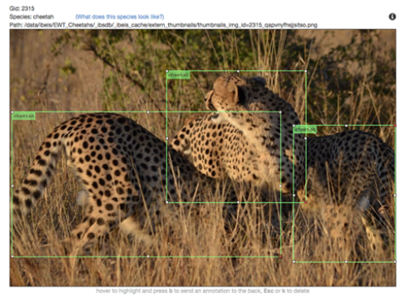
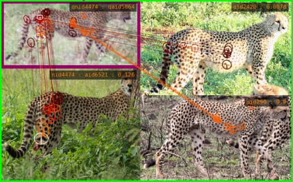

As the price of photography and video equipment drops while quality and availability improve (think “GoPro”), images and video from tourism are becoming the most abundant and inexpensive sources of wildlife data. If these images could be widely obtained, rapidly analyzed and combined with related data (e.g., location, date, behavior), then ecologists could benefit from larger and broader data sets to understand and prevent further wildlife population declines. An increase in well managed data input and processing power enables advances in analysis and modeling of animal populations, supporting deeper insight and better methods of protection for threatened and endangered animals.

In support of speeding and scaling wildlife research, Wildbook includes a very sophisticated machine learning (ML) server called [Wildbook Image Analysis (WBIA)](../developers/wbia/wbia_overview) that provides a multi-stage pipeline for finding one or more animals of one or more species in photos and then routing each detected animal on to the correct individual ID algorithm. WBIA also supports a plug-and-play approach to integrating and wrapping third party machine learning (e.g., new ID algorithms emerging from academic research or competitions), allowing WBIA to serve as the easiest and fastest way to get new AI techniques into the hands of wildlife researchers in the field. Ultimately, the purpose of WBIA is to allow users of Wildbook to more rapidly curate large volumes of wildlife photography in support of research and population analysis.

WBIA generally supports the following stages of execution.

## Detection

Our detection pipeline is a cascade of deep convolutional neural networks (DCNNs) that applies a fully-connected classifier on extracted features. Separate networks produce: (1) whole-scene classifications looking for specific species of animals in the photograph, (2) object annotation bounding box localizations, (3) bounding box rotation prediction and normalization, and (4) the viewpoint, quality, and final species classifications for the candidate bounding boxes. In Wildbook, bounding boxes created by WBIA are called "Annotations".

*A poster presentation summarizing some of the stages of WBIA's detection pipeline.*

*Resulting bounding boxes predicted by WBIA's Detection pipeline after running on a photo of three cheetahs.*

At the end of the Detection stage, WBIA should have created the following in preparation for one or more downstream individual ID algorithms:

- Annotations (i.e. bounding boxes) around each animal in each photo and potentially "parts" bounding boxes, which denote a feature about that animal, such as a fin bounding box "part" on an Orca body bounding box
- species labels on each Annotation
- viewpoint labels (e.g., left, right, top, bottom, etc.) on each Annotation
- OPTIONAL: background segmentation on each Annotation to remove as many non-animal pixels as possible
- OPTIONAL: rotational correct, standardizing the rotation of Annotations to maximize their comparability in downstream ID algorithms

### FAQ

*Can WBIA detect and label any species?*

No. Detection relies on pre-trained ML models, which may be trained on one or more specific species (e.g., a model for snow leopards, a separate model for orcas, and yet a separate model trained on multiple species of finned whales). WBIA provides the tools to manually annotate training data for new species to create these ML models, but this must be done as a pre-cursor to using WBIA for a specific species in Wildbook.

*What does manual annotation look like for ML training?*

[Here is a link to an example training video for annotation for a new species.](https://youtu.be/qD7LKWQIfeM)

*I am a software developer of ML engineer. How can I learn more about WBIA?*

See [Wildbook Image Analysis (WBIA)](../developers/wbia/wbia_overview).

## Identification
The second major computer vision step is identification, which assigns a name label to each annotation from detection. To do this, SIFT (scale-invariant feature transform) descriptors are first extracted and then compared at keypoint locations. Scores from the query that match the same individual are accumulated to produce a single potential score for each animal. The animals in the database are then ranked by their accumulated scores. A post-processing step spatially verifies the descriptor matches and then re-scores and re-ranks the database individuals.

*Example correct identifications. The upper left annotation in each frame is the annotation to be identified. The other frames are the other annotations for the same animal. The bottom left annotation is the primary matching frame. The colored line segments show connections between corresponding features of the same animal.*

