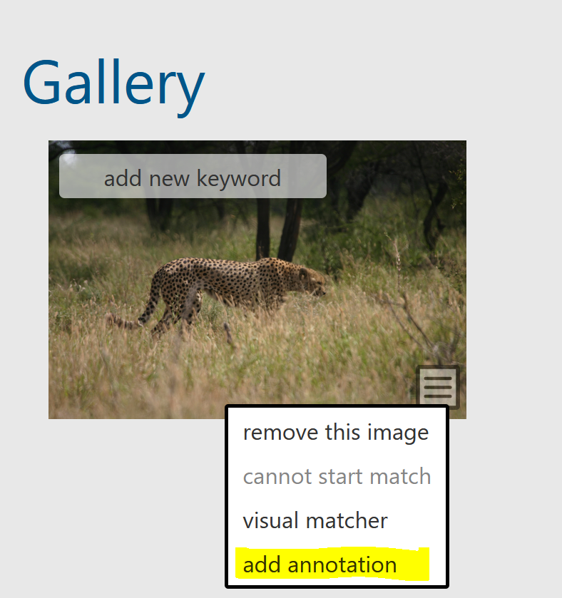

When looking at an Encounter page, you may see that the MediaAsset does not have a dashed rectangle (e.g. bounding box) around the animal in the picture. In this case, the detection stage has not recognized the animal. This is a natural occurrence when using machine learning (ML) to automate the process.

## Navigating to the Manual Annotation Page

Under Encounter > Gallery, open the right-side menu and select add annotation to be navigated to the manual annotation screen.

## Understanding the Manual Annotation Page

MediaAsset provides a link and reference number for the MediaAsset you are annotating.

Select Viewpoint is used to indicate the postioning of the animal. If you are looking at the right side of the animal and it is mostly facing away, then you would select 'rightback'.

iaClass is used to indicate what species is in the picture and what it should be matched against. If you are matching a species part, look for the species in addition to the part. For example, if searching for photos of green turtle heads, search 'turtle_green + head'.

The image provides a canvas for you to directly designate where the bounding box should be placed around the animal.

The Encounter reference link navigates you to the original annotation. The annotation will be cloned, meaning all of the metadata will appear for both the original encounter and the new encounter you are creating with the new annotation.

Save is used to save the annotation after you have placed its bounding box.

## Creating a Manual Annotation

Each step needs to be completed for the next step to appear on the screen.

1. Select 'Viewpoint'.
2. Select 'Annotation iaClass'.
3. Hover your mouse over the image, then use the guides to align the corner with the outer edges of the animal.
4. Click once to mark the first corner of the bounding box.
5. Move your mouse to the opposing corner position (i.e., if top-left complete, move to bottom-right). Use the guides to align the corner with the outer edges of the animal.
6. Click to mark the opposing corner position.
7. Click 'Save' to save your new annotation.

At this point, you can navigate back to the Encounter page and start matching for this new annotation.

## Troubleshooting 

#### How do I fix an annotation?

If an incorrect annotation is created, whether through the detection process or manually, take the following steps to correct it:

1. Navigate to the encounter with the incorrect annotation.
2. Open the manual annotation interface.
3. Label and draw the correct annotation and click 'Save'.
4. Do this for all annotations the need to be created and/or edited.
5. Navigate back to the original encounter.
6. Delete the encounter.

#### How do I annotate a part of an individual (Ex. head, tail, etc.)?

When selecting the annotation iaClass, look for the species, plus the part. For example, if you would like to annotate green turtle heads, search 'turtle_green + head'.

#### How do I associate a part with the body in my encounter?

Unfortunately, this function is not currently supported.

