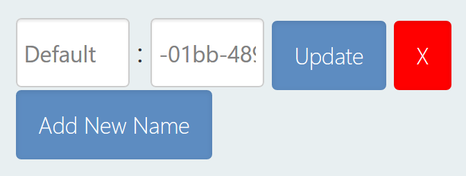

An Individual, or Marked Individual, is an animal that has been given an identifying name within the Wildbook platform. Individuals are animals that have been confirmed by a researcher to have accurate metadata, such as tags, keywords, and social information.

Individuals have one or more encounters associated with them, which can be accessed by viewing the individual’s profile. This allows a researcher to review and study where the individual was over time.

Individual pages can be accessed using the Individual search or by navigating from a linked encounter.

## Navigating an Individual

When you first navigate to an Individual page, you can view and edit the following information.

### Individual overview

The overview contains the following information; to change the information, select the Edit button located in the overview section.

Individual name: Each individual is named at creation. This name is assigned as the Default. You can enter a new name and select Update. If you remove the given name, the individual will display the UUID in the database.Additional names can be assigned to the individual, such as nicknames or project identifiers. To do so, select Add New Name, then provide a label and a name value to go with the label before you select Update.

Edit names and other identifiers of a Marked Individual

Name changes that impact display will require a page refresh before they display.

Sex: If the sex is known, it can be set or adjusted using the Sex dropdown.
Taxonomy: taxonomy is derived from the species associated with the linked encounters.
Date of Birth: The date of birth of the individual. This gets entered in the format YYYY-MM-DD. The field contains an example of the format, but is blank until a date is entered by a researcher.
Date of Death: The date of death of the individual. This gets entered in the format YYYY-MM-DD. The field contains an example of the format, but is blank until a date is entered by a researcher.
Alternate ID: Another position to add an ID.
Encounter Gallery: a carousel of each media asset associated with the linked encounters.

### Social Group Memberships

To support tracking animals that operate in social groups, Wildbook can support the creation and assignment of individuals to groups, representative of social orders like packs or pods. Membership is what to use when naming a role as related to the group, such as alpha or scout.

#### Create a new group

Under Social Group Memberships, select Edit/Add.
Enter the name in New Social Until Name.
Optionally, you can enter any of the following:

Role Name: Enter the name of the position the individual holds in the social group.
Membership Start: When the individual joined the group.
Membership End: When the individual left the group.
Select Edit/Create.

#### Edit an existing group

Under Social Group Memberships, select Edit/Add.
In the Social Group Name dropdown, select the group you intend to adjust.
Make any adjustments you want to the social group fields.
Select Edit/Create.

#### Remove an existing group

Under Social Group Memberships, select Edit/Add.
In the Social Group Name dropdown, select the group you intend to remove.
Select Remove.

### Supporting data

The tables show major data contributions that support the creation of the individual, including all linked encounters and all provided biological samples.

#### Encounter Table

All encounters that the user has access to display in a table. A total count of the number of encounters that make up the individual is also provided.

#### Biological Samples

All biological samples associated with the encounters that make up the individual are displayed.

### Social Relationships

To support tracking the relationships that develop between animals, Wildbook supports the creation and assignment of individuals to social relationships. Relationships are used to describe relationships between two individuals, such as familiar relationships between a mother and child.

#### Add a relationship

Under Social Relationships, select Add relationship.
Set the Type of relationship. By default, the type is familial.
Individual 1 defaults to the current individual.
Set Individual 1 Role to the relationship role you want associated with the current individual.

Optionally, provide an additional Descriptor for the relationship. This value is not constrained. Some suggested uses are to indicate degree of certainty of the relationship or to indicate if this is a primary or secondary role based on behavior that aligns with relationship.
In Individual 2, start typing the name for a second Individual. A dropdown list will populate with matching options; select from the dropdown.
Set Individual 2 Role to the relationship role you want associated with the current individual.

Optionally, provide an additional Descriptor for the relationship. This value is not constrained. Some suggested uses are to indicate degree of certainty of the relationship or to indicate if this is a primary or secondary role based on behavior that aligns with relationship.
Select Update to confirm the relationship.

#### Social Diagram

The social diagram is a tool to allow for easy visualization of the relationships between individuals. Filters are available by role and relationship type.

#### Social Relationships Table

Navigate to the table to see all relationships that have been created including the individual.

#### Edit a relationship

Under the Social Relationships Table, select Edit on the appropriate relationship.
Make any desired changes to the relationship.
Select Update to confirm the changes made.

#### Remove a relationship

Under the Social Relationships Table, select Remove on the appropriate relationship.
Confirm that you want to delete the relationship by selecting Yes.

#### Co-occurrences

Co-occurrences are used to display instances of individuals being sighted together.

#### Co-occurrences Diagram

The co-occurrence diagram is a tool to allow for easy visualization of the co-sightings between individuals.

#### Co-occurences Table

Navigate to the table to see all instances of sightings that include this individual and others.

### Mapping

The map found here displays the locations associated with the linked encounters.

### Additional data files

If there are data files that need to be associated with the Individual, you are able to upload them. To do so, Browse to the file on your local machine, select Open, the confirm to Send file.

### Collaborating Researchers

All researchers that are associated with linked encounters are displayed. It will include the researcher's name, image, affiliation and, if applicable, research project. These value are pulled from the user profile and cannot be edited from the Individual page.

### Comments

All comments that researchers have provided for a given individual are available to review. You can add additional comments by entering text and selecting Add comments.

## Troubleshooting

### I've discovered that two individuals in the system are the same animal. How do I merge them?

Move all encounters from one individual to the other. When the individual you don't want to keep has no encounters associated with it anymore, it will automatically be removed from the system.