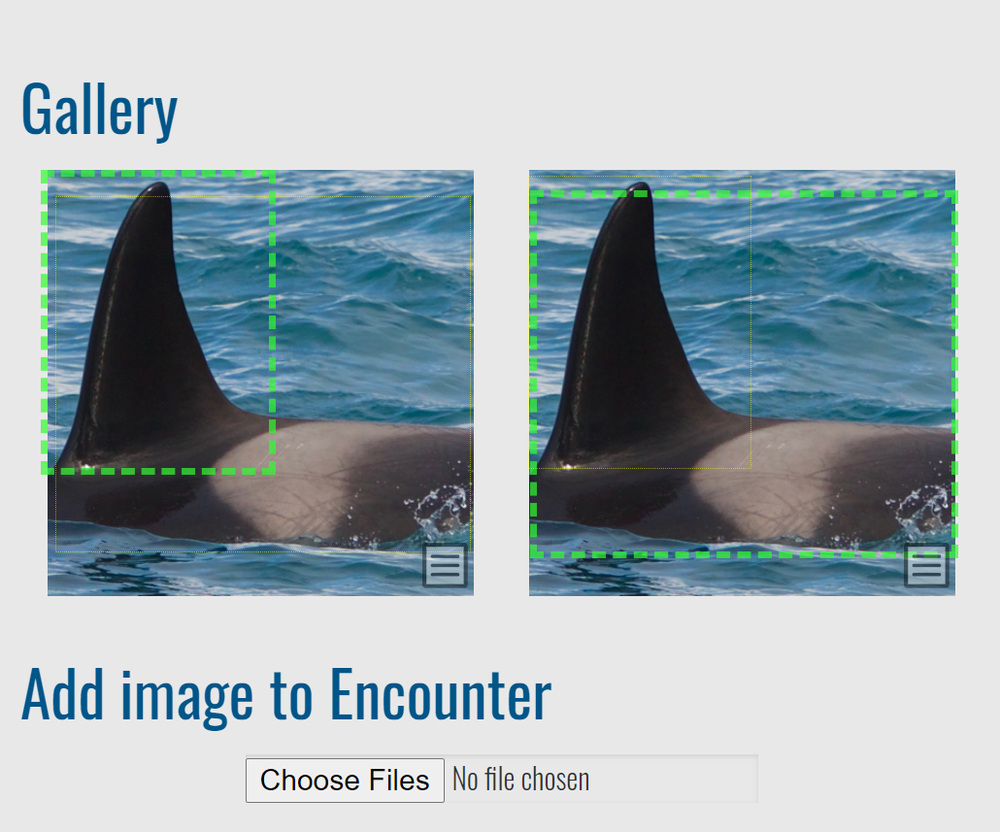
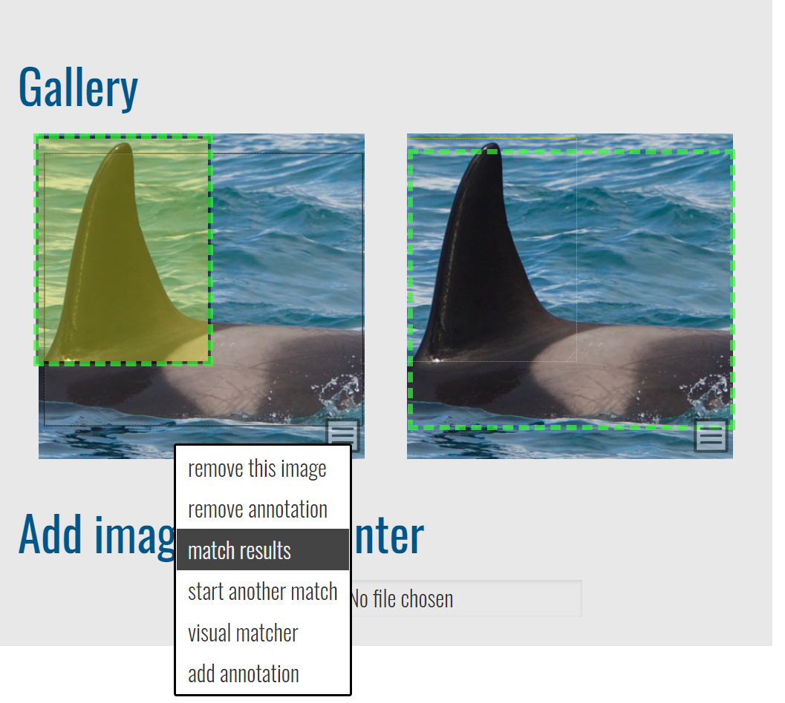
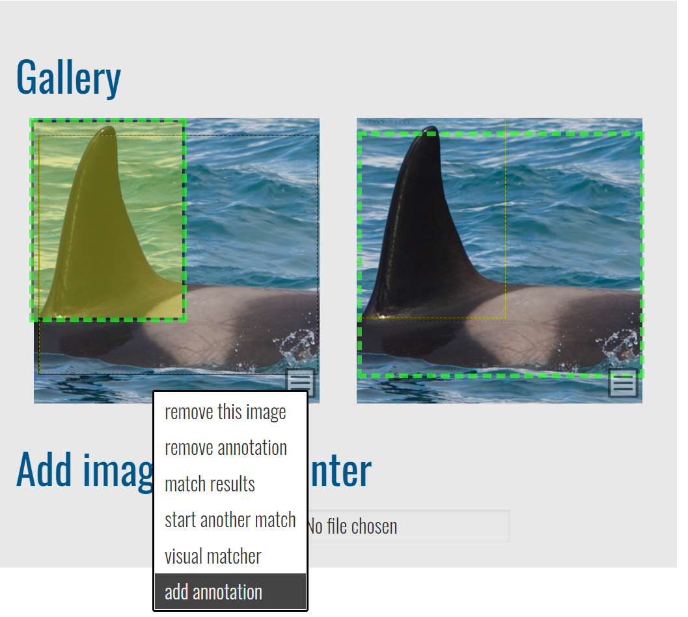
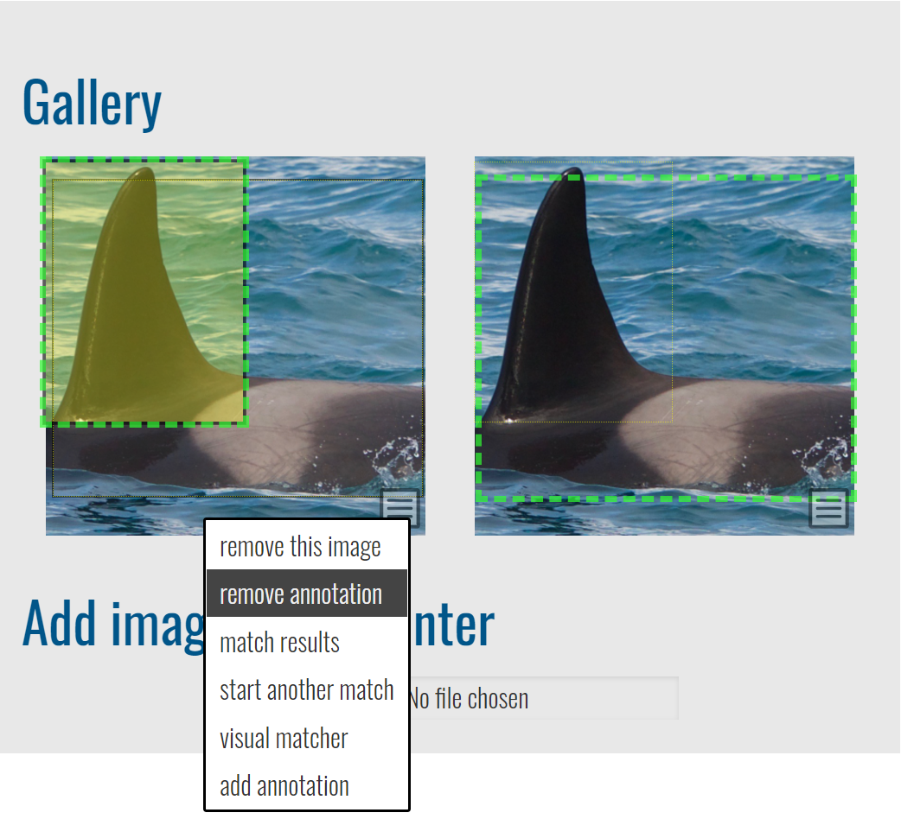
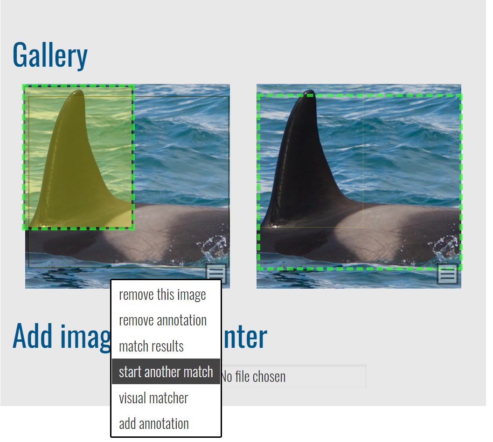
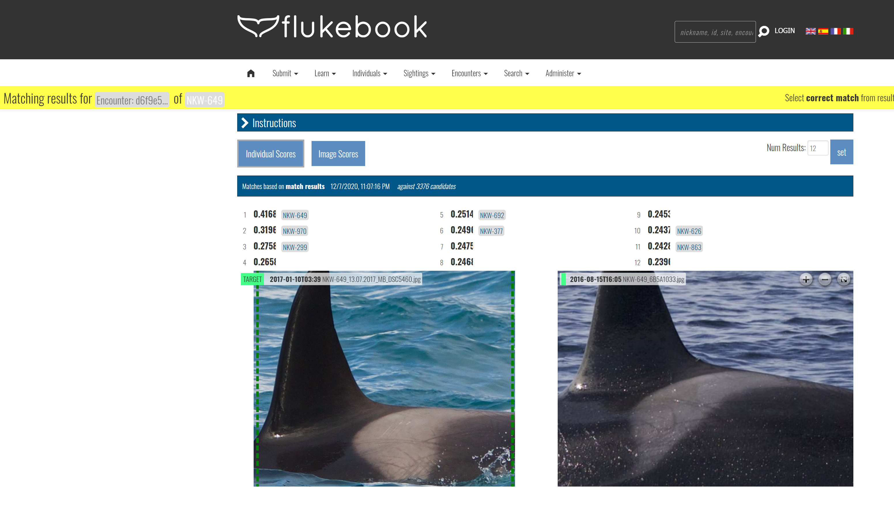
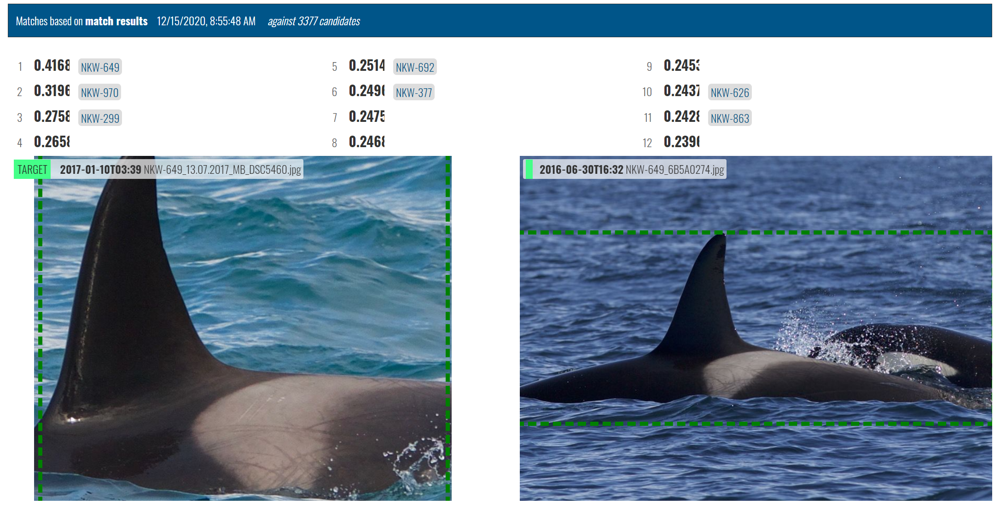
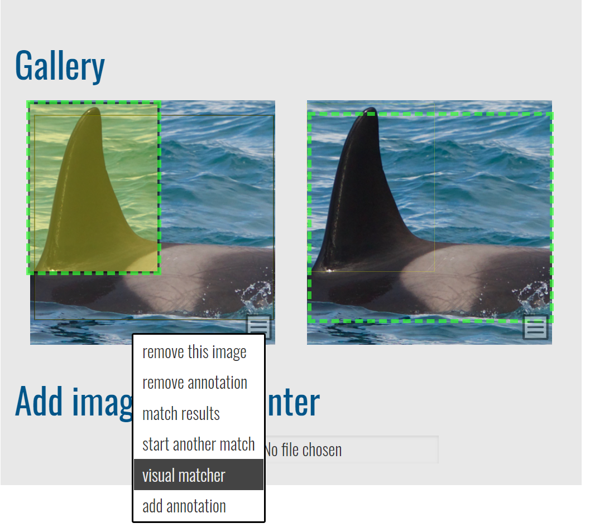

Wildbook provides several ways to automatically and manually access the [Image Analysis Pipeline](ia_pipeline.md) to identify individual animals, as well as to perform by-eye individual ID. Wildbook assists you in photo ID but never makes a decision for you. 

## Automated Detection and ID with Encounter submission

When you [Report an Encounter](report_encounter.md) of a single animal, if you set the species to one supported by the [Image Analysis Pipeline](ia_pipeline.md), Wildbook will automatically perform the following steps:

1. Send each submitted image to Detection to find one or more Annotations in each photo. When Detection 
2. Depending on the type of Annotations returned (its "Image Analysis Class"), such as "whale_orca" or "panthera_uncia", route each Annotation to one or more ID algorithms.
3. Consolidate all Annotation match results into a single page for your review and ID assignment (e.g., setting an existing individual ID or assigning a new ID). See [Reviewing Match Results](#reviewing-match-results) to understand the results page. The Encounter page also allows you to set individual ID later, and you can return to these match results in the future as well.

Because Detection and Identification reside in a queue of computer vision actions requested by all users of your Wildbook, you may not immediately see the results of the [Image Analysis Pipeline](ia_pipeline.md). 

If you see green bounding boxes on images in your submitted Encounter, then Detection has completed. After submission, you may need to periodically refresh the Encounter page for the bounding boxes to appear.

In the example above, two annotations have been found:

- a whale_orca+fin_dorsal (bounding box around the dorsal fin)
- whale_orca (bounding box around the whale body)

If you see green bounding boxes on images in your submitted Encounter and **match results** appears in the menu of any image, then Identification has started or completed. After submission, you may need to periodically refresh the Encounter page for the bounding boxes to appear and match results to be ready. Click **match results** to review potential ID matches. See [Reviewing Match Results](#reviewing-match-results) for more information.

## Automated Detection and ID with Bulk Import

After a successful [Bulk Import](bulk_import.md), Detection and Identification can be run from the import summary, allowing for large scale processing. However, this can also cause delays for other Users attempting to use the [Image Analysis Pipeline](ia_pipeline.md) and its job queue. See [Bulk Import](bulk_import.md) for more information.

## Manual Annotation with Automated ID

While Wildbook uses advance machine learning to find and label animals in images, it always has a probability of missing an Annotation. Wildbook allows you to draw additional bounding boxes on an image, label their viewpoints (e.g., "left", "right", etc.), and their classes (e.g., "whale_fluke", "panthera_uncia", etc.). Once a manual Annotation has been created, its will appear as a normal Annotation on an image and will allow you to [manually start a match](#manually-starting-a-match). See [Manual Annotation](manual_annotation.md) for more information.

### Removing an Annotation

If you don't like an Annotation from machine learning-based Detection or from [Manual Annotation](manual_annotation.md), you can delete it by selecting **remove annotation** from the Encounter Gallery.

Removing an Annotation has these behaviors:

- If multiple Annotations are present on an image, removing an Annotation simply removes the Annotation from the database.
- If multiple Annotations are present on an image, but the removed Annotation is the only Annotation from this image on this Encounter, then both the Annotation and the image are removed from the Encounter. The image (a.k.a. "MediaAsset") and its other Annotations reside still on other Encounters.
- If an Annotation is removed from an image, and this Encounter is the only place the image is referenced, then the image remains on the Encounter.

## Manually Starting a Match

For a matchable Annotation, you can start or re-run matching from the Encounter page Gallery by selecting **start match** or **start another match** from the menu for the Annotation.

## Reviewing Match Results

To review the results of the automated matching process, select **match results** from the menu on the Annotation in the Encounter Gallery. If you recently submitted the Encounter, you may need to wait and then refresh your browser periodically for Wildbook to process the results from automated Detection before the **match results** menu option appears.

Each match result is a unique page and has a unique URL that can be emailed and shared with colleagues for review. New matching tasks replace the old results on the **match results** menu option. Each match result page may show one or more sets of matches, potentially displaying:

- one algorithm match for one annotation (e.g., by clicking **start another match** on an annotation for which only one ID algorithm is configured)
- multiple algorithm matches for one annotation (e.g., by clicking **start another match** on an annotation for which multiple ID algorithms are configured)
- multiple algorithm matches for multiple annotations (e.g., a new Encounter submission with multiple photos)

The information displayed depends on where in Wildbook the [Image Analysis Pipeline](ia_pipeline.md) was called from and for which species.

### Match results page sections

The following sections make up the matching results page.

#### Encounter banner

A banner labeled **Matching results for ** at the top of the page provides a link to the related encounter and the associated Marked Individual, if an ID has been assigned to the Encounter.

#### Instructions

Click to expand the **Instructions** section to get instructions for reviewing matches on the page. Some of those are repeated here:

- Hover mouse over results to **compare candidates** to target.
- Links to the corresponding **encounters** and **individuals** are next to each match score.
- Select **correct match** by hovering over the correct result and checking the checkbox
- Use the buttons to switch between result types:
  - **Individual Scores:** This is the default. It computes one match score for every *individual* in the database. This is the aggregate of each image score for that individual.
  - **Image Scores:** computes the match score for every annotation in the database when compared to the query annotation

* Adjust the number of results that display in each list by changing the value in **Num Results** and selecting **set**.

#### Results: One ranked set per annotation per algorithm

Each block of ranked results represents the top-*N* matches (default top 12) to an Annotation in descending order. Rank 1 is the top suggested match, and each successive match is presented with relatively less confidence. Roll over each row in the list to review the potentially matched annotations. The annotation from your encounter appears on the left, labeled as the TARGET image. Potential candidates for matching appear on the right side, labeled to match their position in the list.

This list contains the following information:

- Rank: The position in the listing (1,2,3,4, etc.).
- Match score: The match score represents the numeric value returned from the algorithm. These scores are not standardized between algorithms or platforms and are generally not bounded. For more information about interpreting algorithm scores, see [Identification](ia_pipeline.md#identification).
- Encounter link: Opens a new tab to the potential match encounter.
- Inspect: Opens a new page focused on the features being matched. Areas that are highlighted display potentially matched features. Not every algorithm will provide additional detail. Only the first 12 matches may have additional detail.
- Checkbox: Select the checkbox to indicate that an encounter is a match with the target annotation.

#### Setting the ID using the checkbox

In addition to setting the Individual ID from the [Encounter page](encounter_guide.md), you can set the ID directly from the match results using the checkbox on any listed result. By clicking the checkbox, one of the following results will be suggested:

- *If the annotation is on an encounter for which the ID has not yet been set and the candidate annotation does not have an ID*, selecting the checkbox will display a new option in the upper right that includes:
  - a typeahead form field that allows you to enter a new ID to assign to both encounters or to look up an existing ID to assign to both encounters.
  - The button **Set individual on both encounters** that allows you to set the ID from the form field. Both annotations and their respective encounters now belong to the same marked individual.
- *If the annotation is on an encounter for which the ID has not yet been set and the candidate annotation has an ID set*, selecting the checkbox will display a new button in the upper right **Set to individual**. Click the button to assign the suggested individual ID to the annotation and its Encounter. Both annotations and their respective encounters now belong to the same marked individual.
- *If the annotation is on an encounter for which the ID has been set and the candidate annotation has a different ID set*, selecting the checkbox will display a new button in the upper right **Merge individuals**. Click **Merge individuals** to merge the two Marked Individuals into a single record, assigning all encounters from both previously individuals to a single individual.

## Visual Matcher

Visual Matcher is a separate, very limited user interface to support visual matching of encounters without computer vision. To access the Visual Matcher, select **visual matcher** on the annotation menu. Visual Matcher was largely developed to support giant manta matching before the availability of computer vision. It has very limited value outside of that task and the MantaMatcher.org platform.

