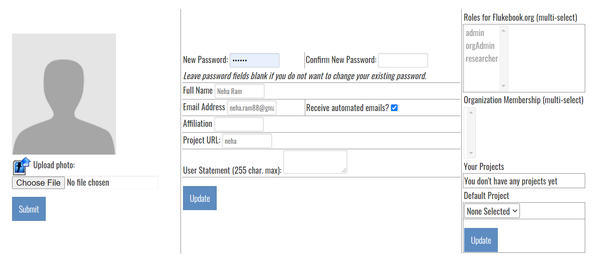
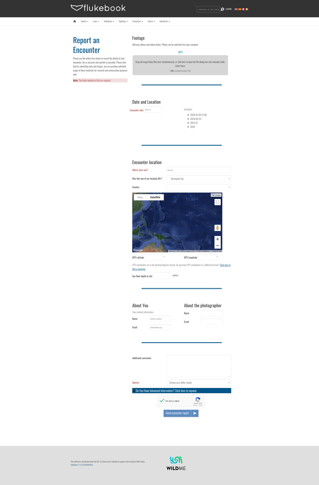
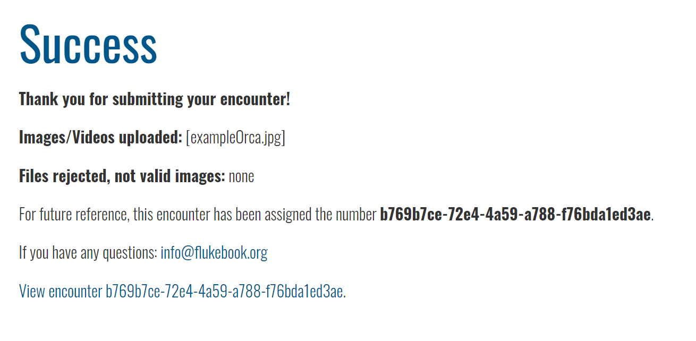
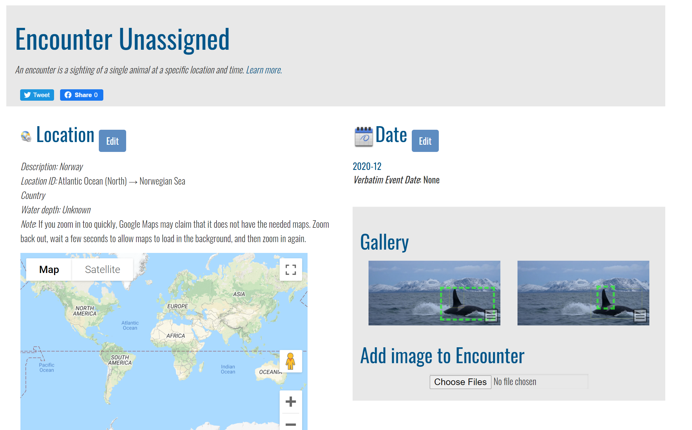
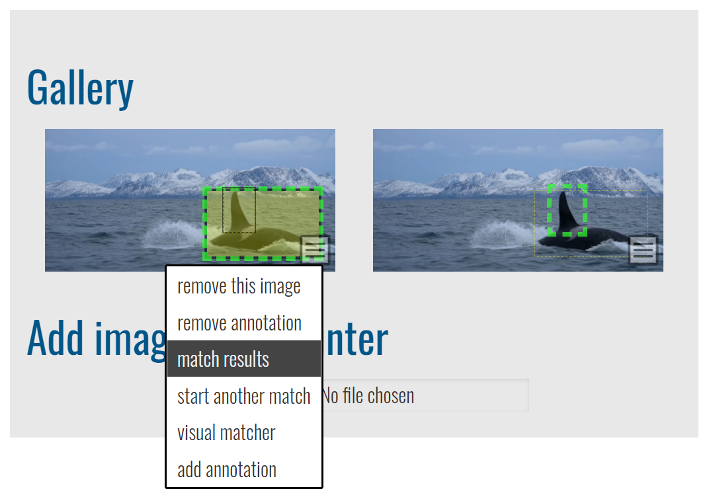
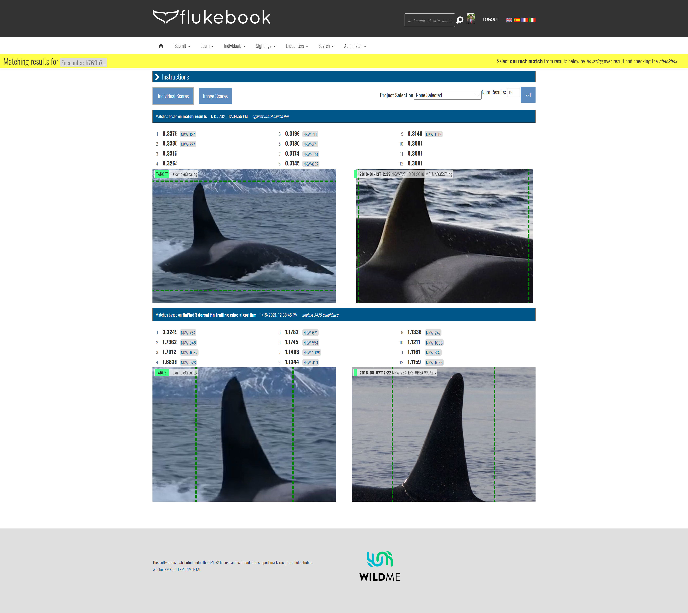
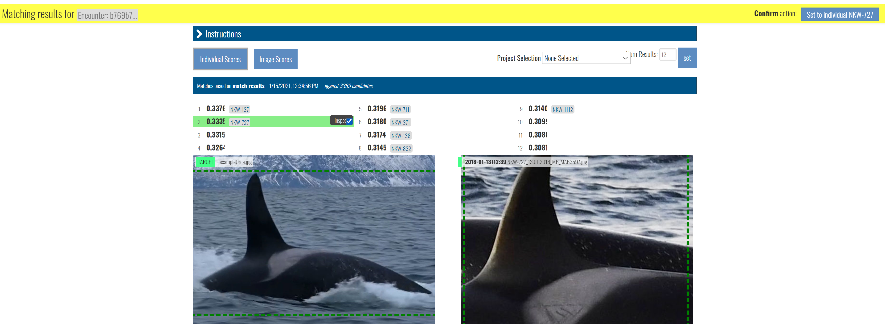
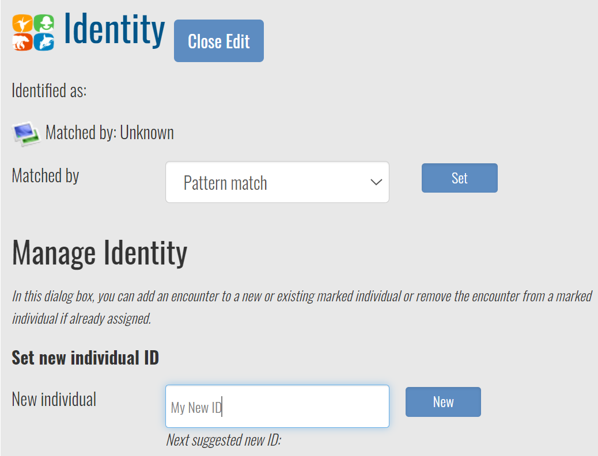

This Quickstart topic covers some basic tasks and concepts when first logging into Wildbook.

## Change your password 

After logging in with your given username and password, the first step to do is to change your password. Head to **My Account** under the **Administer** menu and provide your new password in the **New Password** and **Confirm New Password** sections.

You can also update other information in this section such as your name and profile photo.

## Read Up on Basic Wildbook Concepts

 The Introduction section of the Wildbook documentation provides a good overview of concepts and technologies in Wildbook. [Start with the Overview topic to familiarize yourself with the basics of the platform.](https://docs.wildme.org/docs/researchers/overview)

## Submit and Match Your First Encounters

A great way to get familiar with the [Wildbook Image Analysis pipeline](ia_pipeline.md) is to [report your first Encounter](report_encounter.md). Start simple by submitting a single photograph for a single animal for a species supported by the [Wildbook Image Analysis pipeline](ia_pipeline.md) for individual ID. Consult your Wildbook administrator if you don't know which species are available for detection and identification. Here are the basic steps:

1. Make sure you are logged into Wildbook. This ensures that any Encounter report is assigned to your User account for ownership.
2. From your Wildbook's landing page, select **Report an encounter** from the **Submit** menu.
3. In the Footage area of the Report an Encounter page, click or drag a photo to the gray area to select one photo of one animal. Wildbook can accept multiple photos of the same animal or even a photo of multiple animals, but to keep this example simple, use a photo with only one animal present. For this text example, we will use this Orca photo and submit it to the [Flukebook.org](https://www.flukebook.org) platform for whales and dolphins.
   
4. In the **Date and Location** section use an appropriate **Encounter date** and location description corresponding to the photo. 
5. Complete the reCaptcha to help prevent spam. Our example Encounter report before submission looks like this:
6. Click **Send encounter report**. After clicking **Send encounter report**, you will receive a confirmation page: 
7. Click the **View encounter** link at the bottom to visit your new Encounter.
   
8. In the Encounter shown above, green bounding boxes denoting Annotations from [machine learning detection](ia_pipeline.md#detection) have appeared: one for the orca body and one for its dorsal fin. When you arrive on this page, detection may not have yet completed, and you may see no green Annotation boxes. It may take a minute or more (depending on how busy the [Wildbook Image Analysis pipeline ](ia_pipeline.md) is) for the green boxes to appear. *You must refresh the page periodically for these boxes to appear after detection has completed.*
9. After the green bounding boxes have appeared, if they represent a matchable Annotation class in Wildbook, you can click **match results** from the menu on the image to view the ongoing or completed matching process. 
10. The match results page will show you one set of results for each algorithm run on each Annotation from the submission. In this case, the PIE algorithm as run on the orca body, and the finFindR algorithm was run on the orca dorsal fin.
11. Roll over each potential match (ranked 1-12 from most likely to least likely match) to inspect what each algorithm though was similar between the Annotations. Each result includes a rank, an algorithm-specific score, and potentially additional ID and date metadata to help you evaluate the result. [See Identification for more information about each algorithm used in Wildbook.](ia_pipeline#identification) 
12. If appropriate, set the ID.
    1. If you find a matched individual in the results, roll over the match and click the checkbox. A **Set to individual** button will appear on the right and allow you to set the individual ID on the Encounter you submitted. Congratulations! You made a match. 
    2. In this example, this orca did not match any of the proposed match results. This is likely a new individual to the catalog. To set a new ID, return to the Encounter page and click **edit** in the **Identity** section to **Set new individual ID** as shown below. The name you set will become the default name for the individual, but you can set nicknames and other IDs in addition to this one later. 
13. Congratulations! You have matched or made your first Marked Individual in Wildbook! Click on the ID in the Encounter page to view the Marked Individual's page and see your submitted Encounter listed.
14. On future logins, you can return to this Encounter from the table displayed when you select **View my submissions** from the **Encounters** menu. 

## Next Steps

The following steps are common after getting started with Wildbook.

### Extend Collaboration Invites

If your Wildbook supports [Silo Security](silo_security.md), you may want to extend invitations to collaborate to other Wildbook users, allowing view-only or edit-level permissions to your data in Wildbook. See [Silo Security](silo_security.md) for more information about how to extend collaboration invitations from the [My Account page.](my_account.md).

### Request Further Configuration

Wildbook may need further configuration to better suit your research. Common configuration changes that can be made include:

- Adding your project's study sites (also known as "location ID" in Wildbook) that represent distinct areas where you conduct your data collection. [Click here to learn more about study sites.](locationID.md) 
- Associating your User account with an Organization and/or providing you with [orgAdmin privileges](org_admin.md) to allow you to bring additional Users into Wildbook for your organization
- Adding additional species to Wildbook
- Working with Wild Me to create new machine learning or cross-apply existing techniques for a species

If these categories apply, please request support on the [Wildbook community site](https://community.wildbook.org) or contact your Wildbook system administrator.

### Bulk Import Legacy Data for Matching

Many researchers have past data that needs importing into Wildbook, such as to:

- create a base catalog of IDs to match new data against 
- apply machine learning to existing unprocessed data that needs curation and analysis

See [Bulk Import](bulk_import.md) for more information on how to convert your data to an Excel-based format for import into Wildbook.