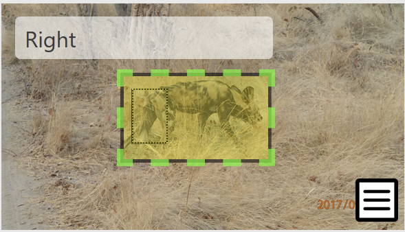

This introduction is intended to support users collecting data in the field, so it only covers the most common interactions with the Wildbook platform. You can also download the PDF for offline viewing.

## Wildbook Terminology

A picture or video gets uploaded to Wildbook. From here, a number of terms come up as we work through the process the system and users take. To better understand the terminology, let’s use this picture as an example.

At this point, we have a MediaAsset. When the system runs the image through detection, it generates an Annotation for each animal found in the picture. This picture would be returned with two annotations, like below.

During upload, you must include a time and place where the interaction occurred; that information is paired with each of the annotations to create an Encounter. Encounters are one-to-one, meaning each encounter is an interaction with a single animal. If you interact with five members of a pack, you have five encounters.

In Wildbook, an encounter is the foundation component of the software. All entries that a user uploads are encounters. Encounters provide a reference to a time and location where an animal was spotted. 

Because two animals appear at the same time in this picture, we want to ensure that the relationship between these encounters is well understood. Wildbook creates a Sighting, a single instance of a human interacting with one or more animals. This allows researchers to include information about social relationships and observed behaviors. It also helps the system spend resources wisely by acknowledging that two animals observed at the same time in the same place can’t be the same animal.

Unlike encounters, sightings are one-to-many; each sighting is one interaction with one or more animals. If you interact with five members of a pack, you have one sighting that is made up of five encounters, one for each animal.

Note: throughout the Wildbook platform, sightings may also be called “occurrences”. We are working to shift terminology for greater user clarity. If you see an instance of outdated language, you can post a bug report.

An Individual is an animal that has been given an identifying name within the Wildbook platform. Individuals are animals that have been confirmed by a researcher to have accurate metadata, such as tags, keywords, and social information.

Individuals have one or more encounters associated with them, which can be accessed by viewing the individual’s profile. This allows a researcher to review and study where the individual was over time.

Note: throughout the Wildbook platform, individuals may also be called “marked individuals”. We are working to shift terminology for greater user clarity. If you see an instance of outdated language, you can post a bug report.

## How does Wildbook handle various photo uploads?

### Single picture of one animal

Suppose a user takes a picture of an animal. The user uploads this picture to Wildbook, along with the associated date and location. For this upload, the system creates an encounter, the Wildbook term for an instance of human and animal interaction. The system then performs detection on the picture, a process intended to automatically find all animals within a picture. Detection causes a box to be drawn around the animal in the picture, what is known as an annotation. If only one annotation is created, then the annotation is associated with the encounter.

Encounters are then sent through the identification process, wherein an annotation is automatically compared against other annotations in the database and the system returns the most-likely matches. During the initial processing, annotations are compared against all other annotations that share the same species and locationID to find the best match. If no locationID is provided, the annotation is compared against the entire dataset. Users can then select from the proposed matches, using all information associated with the encounter to better ensure that the correct selection is made. For example, the computer may have found two nearly-identical animals, but the encounters took place on the same day in different countries, so the user knows that they are not a match.

Note: If a match is not found, a user can attempt to search a broader area when manually starting a matching job but selecting a wider range of locationIDs. To manually start a matching job:

Navigate to the encounter
In the Gallery, select the menu on the bottom right of the annotation that needs to be matched

Select start another match to begin the matching job
Under the Location ID dropdown, select all areas that are relevant and select Match

A user has the option of distinguishing a marked individual, which is a collection of encounters that are all the same animal. The system allows a user to create a marked individual from a single encounter, and then to associate additional encounters with the marked individual.

### Single picture of multiple animals

Some animals are difficult to photograph singly, such as pack animals. A user can upload a picture of multiple animals to Wildbook, along with the associated date and location; for each detected animal, an annotation is created and made into an encounter with the provided date and location. This is a key benefit of annotations, as they allow the system to identify multiple animals within a picture, so users do not need to manually edit and crop photographs.

Because the system detected multiple annotations, it will replicate the encounter it created originally, creating one encounter for each annotation so that each annotation is associated with the correct metadata.

Because the annotations are generated from the same image, the Wildbook preserves knowledge of that connection by associating all the related encounters with a single sighting, or occurrence. An ID is associated with the sighting, and that ID is available in each encounter. Sightings allow users to associate information with all of the encounters tied to that event without having to update each of the encounters individually.

From here, each encounter goes through the identification process individually.

Single picture of multiple animals with additional metadata

If you provide information with a picture of multiple animals, additional complications can occur. For example, in the advanced information, you can indicate the sex or life state of an animal. However, if the picture contains multiple animals, there is no guarantee that, when the encounter is replicated and annotations are each associated with the newly created encounters, the marked individual will be correctly associated with the newly-split annotation.

If you choose to provide additional information during the initial upload of a single picture with multiple animals, it is best practice to review the encounters associated with that sighting and verify that all metadata associations are as expected and if not, edit as needed.

### Multiple pictures of multiple animals

Presently, Wildbook accepts uploads of multiple pictures with multiple animals; however, the system does not preserve data integrity or accuracy well enough for this to be recommended when uploading pictures using the standard upload method.

If you choose to upload multiple pictures with multiple animals at once, it is recommended that you use the bulk import functionality which is available via login, under the Submit menu. Review the on-screen instructions and download the spreadsheet, which you will use to enter the metadata for each of the images you are uploading. When creating your spreadsheet:

Ensure that each row contains one encounter
Ensure that each encounter has a unique occurrenceID. To ensure that you are creating a unique occurrenceID, perform a Sighting search for the ID you are hoping to use. If there are no results, it is safe to use that number. You can create new occurrences according to a defined schema, or you can leverage a UUID generation tool, such as https://www.uuidgenerator.net/version1, to create IDs similar to those created by the platform automatically.If you leave an occurrenceID blank, the system will create a new occurrenceID for that encounter.

Because an image can contain multiple encounters if there are multiple animals in the picture, each image that contains multiple animals should be treated as a separate sighting. To do this, ensure that:

Each encounter from an image with multiple animals shares the same occurrenceID
The provided occurrenceID is unique to the Wildbook At this time, you will need to manually confirm that the IDs do not conflate.

## Navigating the Platform

This section provides an overview of the purpose and location of each page in the Wildbook platform. There may be additional pages based on customizations to the specific Wildbook you are using. Such additions will not be detailed in this guide.

When you first access your Wildbook, you’ll land on the Home page. This can be reached at any time by clicking the home button on the navigation bar. You can also click the site logo to open the home page on a new tab.

The home page is intended to provide context for the work being done leveraging Wildbook. This includes pictures and statistics about the platform.

Under the Submit menu, there are two options: "Report an encounter" and "Bulk Import". Both options are used to submit a sighting, known in Wildbook as an encounter. Submissions include photos or video, time of sighting, and location. 

"Report an encounter" can be used by anyone, while "Bulk Import" requires a user to log into the platform.

Under the Learn menu, there are the following options:

About Us is a page dedicated to the collaborators who have put together the Wildbook you are accessing.
How to Photograph advises on the best ways to photograph a given species. This advice is specific to allowing the machine learning to best leverage the photograph for detection and identification.
Contact Us provides information to allow you to contact those who are managing the Wildbook platform you are using.
Learn More about Wildbook takes you to the Wildbook platform documentation.

All following areas of the platform can only be accessed by a user that has signed in.

Under the Individuals menu, there are the following options:

The Gallery page provides a set of pre-configured filters focused on the images associated with an individual in the platform.
View All takes you to an unfiltered list of all individuals you have access to, presented as the Individual Search Results. From here, you can add filters and sort based on the visible columns, as well as accessing additional options.

Under the Sightings tab, also known as an Occurrence or group of related Encounters, you have the following options:

Search pulls up several filters that can be leveraged to generate a filtered list of all sightings that the signed-in user has access to. Once the list is generated, data can be exported in various formats from this page.
View All pulls up an unfiltered list of all sightings you have access to.

Under the Encounters tab, you have the following options:

View Unapproved Encounters pulls up a list of all encounters that have not had their state adjusted from “Unapproved”. All individually-uploaded encounters are initially uploaded as unapproved encounters. This is done to allow researchers and trained individuals to support citizen scientist involvement while maintaining data integrity.
View Approved Encounters pulls up a list of all encounters that have been determined to be acceptable based on data review. The state has been adjusted to “Approved”. Note that all encounters entered using the bulk import function are set as approved by default as only users with researcher-or-higher privileges can make use of the importer.
View Unidentifiable Encounters pulls up a list of all encounters that provide evidence that cannot be conclusively judged, causing a user to set the state to “Unidentifiable”.
View Images pulls up a list of all images that a user has access to, including annotation bounding boxes and keyword displays. From this screen, you can manually start the matching process against an image or you can open the Visual Matcher, which provides prompts of potential matching encounters based on the most recent matching job run.
Encounter Calendar is an option to display all encounters in a calendar format.
View My Submissions pulls up a list of all encounters that were submitted by the signed-in account, regardless of state.

Under the Search tab, you have the following options:

Encounter Search pulls up several filters that can be leveraged to generate a filtered list of all encounters that the signed-in user has access to. Once the list is generated, additional filtering and sorting can be performed on the Encounter Search Results page, as well as delving into additional data formats such as matching images and videos, mapped results, and a results calendar. Additionally, data can be exported in various formats from this page.
Individual Search pulls up several filters that can be leveraged to generate a filtered list of all individuals that the signed-in user has access to. Once the list is generated, additional filtering and sorting can be performed on the Individual Search Results page, as well as delving into additional data formats such as matching images and videos, and mapped results. Additionally, data can be exported in various formats from this page.
Sighting Search pulls up several filters that can be leveraged to generate a filtered list of all sightings that the signed-in user has access to. Once the list is generated, data can be exported in various formats from this page.

A user is able to Login by selecting the Login button at the top right or by selecting any page that requires a user to sign in to access content. A username and password are required. If you do not have a username and password, you will need to contact the site managers via the Contact Us page.

Under the Administer tab, you have the following options:

My Account provides a collection of information about the signed-in user, including password reset, and profile picture management, a list of accepted collaborations, and statistics about the data associated with the account.

For information about the site administration capabilities, see the admin guide.

## Manage Encounters

An encounter is a sighting of a member of a target population of a single species. Each encounter contains data that represents one individual at one point in time. 

### Report an Encounter

Complete the following steps to successfully submit an encounter. These fields are the minimum requirements. Any additional data provided can assist with detection and identification, but will not prevent a user from uploading their encounter.

Access your Wildbook homepage.
From the Submit menu, select Report an Encounter.
Under Footage, drag a file or click to add an image or video.
Under Date, enter a date in the Encounter date field. Use an ISO format (YYYY-MM-DD HH:mm).
Under Encounter location, provide a Location ID. If this is not available, use one of the other location reporting methods.
Under About You, enter your email address in the Email field (Name is preferred, but optional).
Under Species, select the species in  your encounter from the dropdown menu. If unknown, select unknown.
Click Send encounter report.

Your encounter is now available as an unapproved encounter.

### Additional fields

Should you want to include additional information with your encounter, you can provide information in the following fields:

Project: if the picture was taken as part of a specific effort, such as a census event
Additional comments: any information that does not seem relevant in another field
Sex: Indication of if the photographed animal is male, female, or unidentified
Observed behavior: Description of behavior that occurred during the encounter, such as environment interactions or interactions between two animals
Noticeable scarring: Description of scarring that can be used to identify the animal
Life stage: A list of age groupings that can be applied, such as adult or juvenile

If you are submitting as a signed-in user, you will also have the following options:

Status: If the animal is alive or dead
Alternate ID: Allows for entry of any other IDs that may be used for finding the picture, such as a catalogue number from your records
Sighting ID: A reference number for a collection of encounters that occurred at the same time
Other Email Addresses: Allows for a list of email addresses, separated by commas. The emails provided will receive updates regarding the encounter as information is added to the platform, such as resightings or association with a marked individual.

## Bulk Import

To allow for integration of legacy data or other large volumes of data into the platform, we have enabled a system of uploading a large amount of data all at once. This capability is called bulk import, and allows users with login privileges to provide encounter information and related metadata en masse. Because this workflow is only accessible to authorized users, the encounters are uploaded as approved encounters.

Note: this functionality is in alpha. Changes to the process or UI may occur. Any substantial changes will be announced before they take place.

The bulk import process involves 3 steps: photo upload, spreadsheet upload, and import process. An example of these steps is available as a downloadable zip file to demonstrate what is described here.

### Photo Upload Preparation

Photo upload is the easiest part of the process to set up. See the photo directory folder in the example.

Create a folder.
Move all images you intend to upload to the folder.
Ensure that all file names are distinct.

### Spreadsheet Upload

Setting up the spreadsheet requires some adjustments. All columns in the spreadsheet are optional and column order doesn’t matter; just ensure that you have some version of location and date data associated with each image at a minimum.

The second sheet provides information about each field that is included in the provided spreadsheet. Adhere to these explanations as closely as possible.

Determine what columns you have data for; add and remove columns as needed.
Fill out each line for a single encounter. If an encounter is associated with a sighting (or occurrence), include the needed information for the sighting on one line of an associated encounter.
If leveraging any of the occurrence fields, ensure that each encounter is associated with an occurrence.occurenceID.
Verify the following fields match exactly what exists in the system:

Encounter.submitterID - this is your username
Encounter.mediaAsset - this is the exact file name of each image

IMPORTANT NOTE: Metadata can only be uploaded ONCE per image, using the Upload Spreadsheet. If revisions to any uploaded metadata are needed, they must be done on the relevant encounter record in the system.  If you have questions, please contact us.

### Import Process

With the directory and spreadsheet complete, navigate to the Bulk Import page.

Select Upload Photos.
Browse to your photo directory and select Upload.
Select Begin Upload to be taken to the photo review page.
Review that all photos you have uploaded are available in the import. If they are, select Accept and move on.
Browse to your spreadsheet and select Open.
Select Begin Upload to be taken to the import overview.
Review the data integrity. Note that the system will verify the data in the spreadsheet against ALL images you have in the system, not only the ones you are currently uploading. Review the online data integrity report carefully before initiating an upload.

If everything looks as expected, select Commit these results and confirm to import all data.

## Manage Encounters

Newly reported encounters are considered unapproved, which indicates that the encounter has not been reviewed for quality.

From the Encounters menu, select View Unapproved Encounters.
Select an encounter.
Review the encounter by checking for photo quality and data accuracy, including location data.
Note the presence of any distinguishing characteristics using the pulldown list of keywords.

If the encounter is suitable, navigate to the Metadata section, click "Edit", modify Workflow state to "Approved", and then click "Close Edit" in the Metadata section. At this point, the encounter will be generally available.

If the encounter is not suitable, it is a good idea to leave the encounter unapproved to give the submitter a chance to improve the data.

### Find an Encounter

You can leverage both search and filter to locate a specific encounter.

From the Search menu, select Encounter Search. Use the following filters to limit the results you get back.

Location filter (map) allows you to define a boundary box on a map and initiate a search based on encounters in that location.
Location filters (text) allow you to execute a search against location IDs and verbatim location descriptions in your library.
Date filters allow you to search by a date range and/or by pre-defined verbatim date(s) (e.g., “Summer sampling 2004”).
Observation attribute filters allow you to search by sex, status, length, behavior descriptions or pre-defined keywords.
Identity filters allow you to search across encounter by marked individual attributes, such as alternate ID or number of sightings.
Tags filters allow you to search on Metal, Acoustic, and Satellite Tag metadata.
Metadata filters allow you to search by encounter approval status (Approved, Unapproved, and/or Unidentifiable), photographer name and/or email, project, observation comments, and/or organization membership of the submitter if shared with your membership. In many cases, you can choose more than one option from the selection menu (e.g., say "Unapproved" and "Unidentifiable" encounters).

### Find an Encounter 

You can leverage both search and filter to locate a specific encounter. 

From the Search menu, select Encounter Search. Use the following filters to limit the results you get back. 

Location filter (map) allows you to define a boundary box on a map and initiate a search based on encounters in that location. Click Load Markers, then use the magnifying glass on the upper right side of the map to allow you to draw the bounding box.
Location filters (text) allow you to execute a search against location IDs and verbatim location descriptions in your library.
Date filters allow you to search by a date range and/or by pre-defined verbatim date(s) (e.g., “Summer sampling 2004”).
Observation attribute filters allow you to search by sex, status, length, behavior descriptions or pre-defined keywords. Additionally, you can Add another Searchable Observation. Select the button to bring up the name and value fields, and enter the information in the appropriate fields.
Identity filters allow you to search across encounter by marked individual attributes, such as alternate ID or number of sightings.
Tags filters allow you to search on Metal, Acoustic, and Satellite Tag metadata.
Metadata filters allow you to search three types of encounters - Approved, Unapproved, and Unidentifiable. You can choose more than one encounter type.

## Manage Marked Individual

Marked Individuals are uniquely identified members of an animal population that includes one or more reported encounters.

### Add a Marked Individual

Once an encounter has enough information that you are confident about an individual's identity, you can add the marked individual to the database.

Navigate to the encounter.
Click the edit icon on the Identity section.
Under the "Manage Identity" subheading, enter a new, unique ID in the New Individual field.
Click New.

### Add Encounter to a Marked Individual

Some of the more important capabilities of Wildbook come from multiple encounters being associated with a single marked individual. This allows researchers to track movement over time, which can lead to interesting conclusions. 

Navigate to the encounter you want to include as part of the marked individual.
Click the edit icon in the Identified as: field.
Under Add to Marked Individual, enter the individual you want to assign to the encounter in the Individual: field.
Click Add.

### Find an Individual

You can leverage both search and filter to locate a specific encounter.

From the Search menu, select Individual Search. Use the following filters to limit the results you get back.

Location filter (map) allows you to pinpoint a location on a map, and initiate a search based on that location.
Location filters (text) allows you to execute a string search against location codes and descriptions in your library. This filter also allows you to specify one or more location IDs.
Date filters allows you to search by date.
Observation attribute filters allow you to search by these characteristics:

sex
length
photo keywords
submitter name
photographer name
submitter or photographer email address
Identity filters allow you to search for a marked individual who has been sighted multiple times by setting the Maximum years between resightings field. You can also search the marked individuals in your database by Alternate ID.
Tags filters allow you to search on Metal, Acoustic, and Satellite Tag metadata.

## Manage Sightings 

A sighting, or occurrence, is an observation of multiple individuals together. In Wildbook, this means that a sighting consists of multiple encounters observed over a short period of time. Sightings represent groups and potential relationships between individual animals. 

### Create a sighting

Sightings are created when you associate encounters with an Occurrence ID. Note that sightings and occurrences are interchangeable terms. 

Navigate to an encounter page that represents one of the animals sighted.
Select Edit in the Identity grouping.
Enter a New Occurrence ID in the Create Occurrence field.
Select Create.

### Add Encounter to a Sighting

After a sighting has been created, you can add multiple encounters to the sighting. 

Verify the ID of the sighting you want to add the new encounter to.
Navigate to the encounter page that represents an animal that’s part of an existing encounter.
Select Edit in the Identity grouping.
Enter the Occurrence ID in the Add to occurrence field.
Select Add.

## Export Data

By leveraging the search results capabilities, you can export data to a variety of easy-to-use formats.

Access the search option you want to use: encounter, individual, or sighting.
Use the provided filters to generate the list you desire.
Once the results have loaded, click the Export tab.
Select your desired output format.