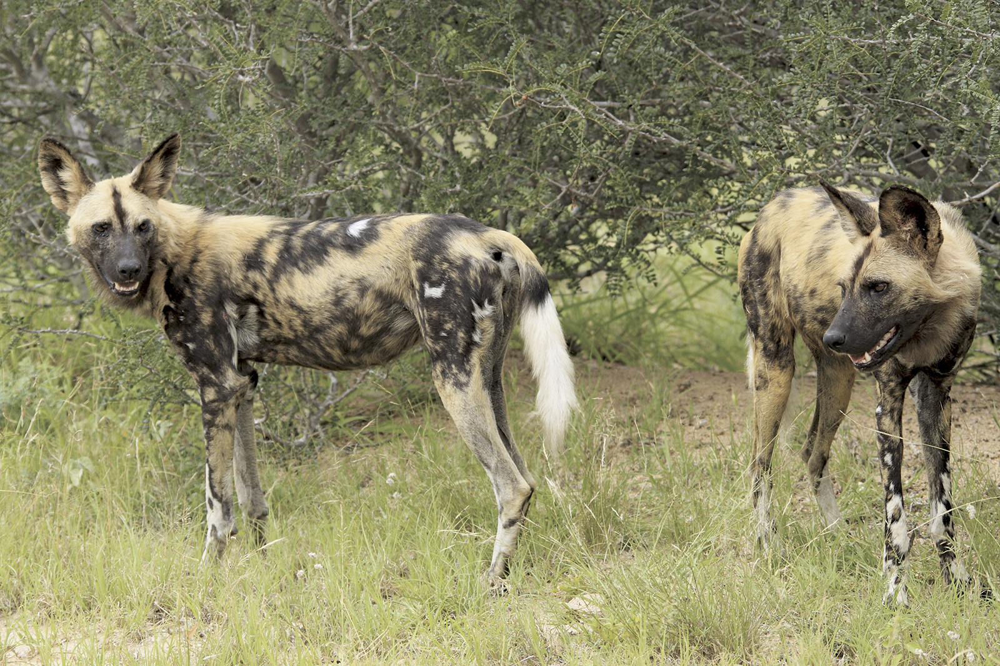

Wildbook is a web-based, multi-user software platform to help researchers collaboratively track individual animals in wildlife populations and estimate population sizes. Each Wildbook installation can be used by multiple researchers for multiple species. 

This introduction covers the most common interactions within Wildbook platforms. It is intended to support Wildbook users and researchers collecting data in the field and to illustrate how to use Wildbook for data storage, curation, searching, and analysis.

Included Wildbook features:

- A browser-based user interface (UI)
- A high performance PostgreSQL database for storing multiple wildlife-related data types
- Two servers:
  - Data Management Server - Coordinates UI browser display and data storage
  - [Wildbook Image Analysis ("WBIA")](../developers/wbia/wbia_overview) - Manages the computer vision pipeline and and artificial intelligence (AI) models and training tools. WBIA does not come pre-configured to detect and/or identify animals from a species. Pre-trained machine learning (ML) models for the species must be used, or new models must be created and configured using training data.
- Artificial intelligence (AI) tools to enhance image curation by:
  - Finding one or more animals in a photo or photos ("Detection")
  - Individually identifying each animal detected ("Identification")

*The Wildbook ecosystem of people, servers, and AI.*

## Wildbook Terminology

In its simplest usage, Wildbook receives a wildlife picture and its related metadata (e.g. where the photo was taken and when), which gets uploaded by a researcher. The following terminology is used by Wildbook programs as users curate their wildlife data. To facilitate a better understanding of these terms, we will work through the process Wildbook and users take to upload and manage their wildlife data. Let’s use the picture below as an example:

In Wildbook, an uploaded picture is called a **MediaAsset**. When the system runs that image through a machine learning (ML) stage called "Detection", it generates an **Annotation** for each animal found in the picture. Because this photo contains two African wild dogs, it would be returned with two Annotations, as shown in the bounding boxes below.

During the uploading process, you must include the time and place where the interaction occurred. That information is paired with each Annotation to create an **Encounter**. An Encounter represents an interaction with a single animal. If you interacted with five members of a pack at a specific place and time, your result would have five Encounters. Encounters are the foundational components of Wildbooks software. They provide a reference to a time and location where an animal was spotted, forming the basis of whether that animal ultimately should or should not be included in a population analyses. In the photo above, Wildbook's ML process detected two Annotations of African wild dogs, and thus two Encounters would be generated from the one MediaAsset. Wildbook creates web pages for each Encounter for referencing.

Because more than one animal appears at the same time in this example MediaAsset, we want to ensure that the relationship between these two Encounters is well understood (i.e. *These two animals were sighted together.*). Therefore, Wildbook creates a **Sighting**, representing a broader observation of one or more animals. A Sighting allows researchers to include information about social relationships and observed behaviors when multiple animals are sighted together. Unlike Encounters, Sightings are one-to-many; if you interact with five members of a pack, you have one Sighting that is made up of five Encounters, one for each animal. Like Encounters, Wildbook also creates web pages for each Sighting.

An **Individual** is a single animal that has been given an identifying name/Annotation within the Wildbook platform and has one or more Encounters. Individuals are animals whose identities and metadata (eg. tags, keywords, social information) have been confirmed by a researcher. Every Individual has a profile page in Wildbook, summarizing where the individual was sighted over time, any **Relationships** (e.g. mother-calf) or **Social Units** (e.g. a pack or herd) it may be a part of, and which researchers have contributed to building this Individual's profile.

*Note*: Throughout Wildbook, **Sightings** may also be called “Occurrences” and **Individuals** may also be called "Marked Individuals". We are currently working to shift terminology for greater user clarity. If you see an instance of outdated language, you can post a bug report [here](https://community.wildbook.org).

## Navigating the Platform

This section provides an overview of the purpose and location of common pages in the Wildbook platform.

### Home Page

When you first access Wildbook, you’ll land on the Home page. This can be reached at any time by clicking the Home button on the navigation bar. You can also click the Wildbook site logo to open the home page on a new tab. The home page is intended to provide introduction and context for the work being done leveraging Wildbook. This includes pictures and statistics about the platform.

### Menu Options

Under the **Submit** menu, there are two options: **Report an Encounter** and **Bulk Import**. Both options are used to submit data. Submissions include photos, videos, and related metadata, requiring at least the date of sighting, location, and species. Additional metadata fields are available.

- **Report an Encounter** can be used by anyone to submit a single encounter of one or multiple individuals. For more information on how to report an encounter, [click here](/docs/researchers/report_encounter).

- **Bulk Import** requires a user to log in to the platform before following the instructions to upload photos and their affiliated Excel data spreadsheet(s). The Bulk Import function allows users to submit both legacy and batched volumes of data in large quantities as opposed to Report an Encounter, which allows for only single uploads. For more information on how to bulk import, [click here](/docs/researchers/bulk_import).

Under the **Learn** menu, there are the following options, which are often customized in Wildbook:

- **About Us** is a page dedicated to the collaborators who have put together the Wildbook program you are accessing.
- **How to Photograph** advises on the best ways to photograph a given species. This advice is specific to allowing the machine learning (ML) to better process the photograph for detection and identification.
- **Contact Us** provides information you can use to communicate with those who are managing the Wildbook platform you are using.
- **Learn More about Wildbook** takes you to the Wildbook platform documentation.

After signing in to the Wildbook platform, you can access the following features:

Under the **Individuals** menu, there are the following options:

- The **Gallery** page provides a set of photos with pre-configured filters, tailored to display the photos of a selected Individual in the platform.
- **View All** takes you to an unfiltered list of all Individuals you have access to, presented as the Individual Search Results. From here, you can add filters and sort based on the visible columns, as well as access additional options.

Under the **Sightings** menu, you have the following options:

- **Search** pulls up several filters that can be leveraged to generate a filtered list of all Sightings that the signed-in user has access to. Once the list is generated, the data can be exported from this page in various formats.
- **View All** pulls up an unfiltered list of all Sightings you have access to.

Under the **Encounters** menu, you have the following options:

- **View Unapproved Encounters** pulls up a list of all Encounters that have not had their state adjusted from “Unapproved”. All individually-uploaded encounters are initially uploaded as Unapproved Encounters. This allows researchers and trained individuals to support citizen scientist involvement while maintaining their data integrity.
- **View Approved Encounters** pulls up a list of all Encounters that have been determined to be acceptable based on data review. The state has been adjusted to “Approved”. 

*Note*: All Encounters entered using the Bulk Import function are set as Approved by default as only users with researcher-or-higher privileges can make use of the importer.

- **View Unidentifiable Encounters** pulls up a list of all encounters that provide evidence that cannot be conclusively judged, causing a user to set the state to “Unidentifiable” (eg. poor photo quality or missing critical metadata).
- **View Images** pulls up a list of all uploaded images a user has access to, including their Annotation bounding boxes and keyword displays. 
- **Encounter Calendar** is an option to display all Encounters in a calendar format.
- **View My Submissions** pulls up a list of all Encounters that were submitted by the signed-in account, regardless of their state of approval.

Under the **Search** menu, you have the following options:

- **Encounter Search** pulls up several filters that can be leveraged to generate a filtered list of all the Encounters the signed-in user has access to. Once the list is generated, additional filtering and sorting can be performed on the **Encounter Search Results** page, as well as delving into additional data formats such as matching images and videos, mapped results, export formats, and/or an encounter calendar.
- **Individual Search** pulls up several filters that can be leveraged to generate a filtered list of all Individuals the signed-in user has access to. Once the list is generated, additional filtering and sorting can be performed on the **Individual Search Results** page, as well as delving into additional data formats such as matching images and videos, mapped results, and exportable data formats.
- **Sighting Search** pulls up several filters that can be leveraged to generate a tailored list of all sightings that the signed-in user has access to.

## Account Management

Wildbook supports security functions that support real world research collaborations and organizations.

### Login

A user is able to log in by selecting the **Login** button at the top right of the Wildbook program or by selecting any page that requires a user to sign in to access content. A username and password are required. To set up a Wildbook account, you will need to contact the site managers via the **Contact Us** page. Wildbook does not currently support self-registration.

### Account Management

Under the **Administer** menu, you have the following options:

- **My Account** provides a collection of information about the signed-in user, including password reset and profile picture management, a list of accepted collaborations, and statistics about the data associated with the account.

For information about your user accounts and security, see [My Account](my_account).
