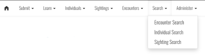
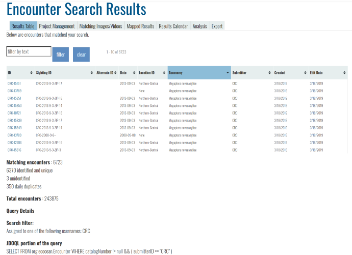
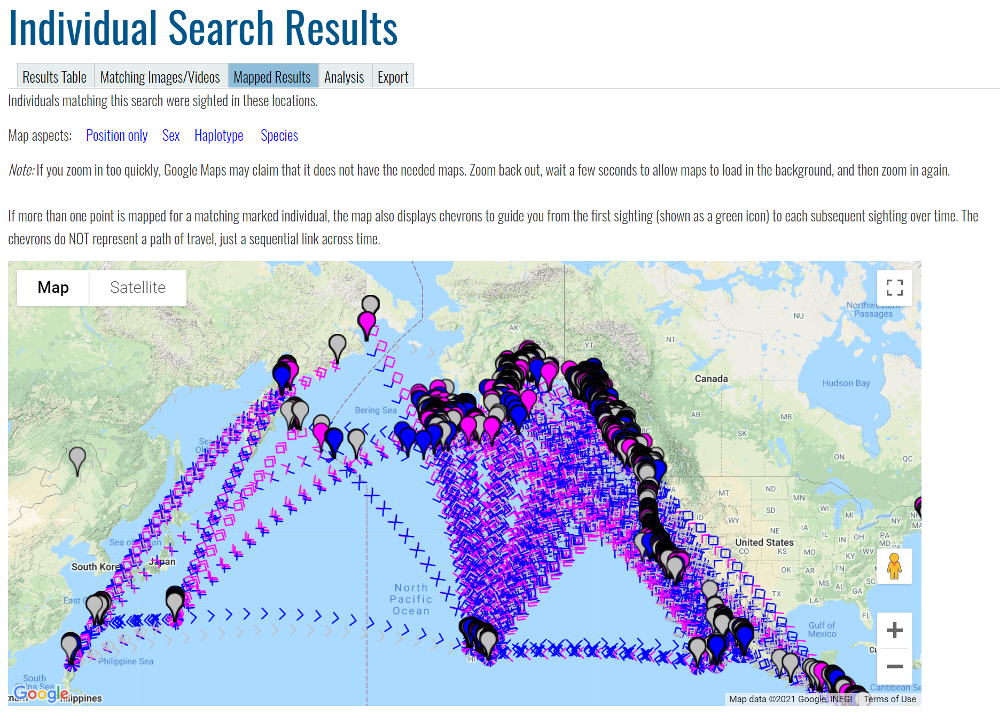

Wildbook supports searching and display of your data in multiple formats. The search types in Wildbook are:

- Encounter Search, which allows you to search through [Encounter data](encounter_guide.md) in Wildbook
- Individual Search, which allows you to search through [Marked Individual data](marked_individual.md) in Wildbook
- Sighting Search, which allows you to search through the [Sighting data](sighting.md) (formerly "Occurrence") in Wildbook

The data returned will match the data type. For example, the same date and location search filters may yield 2001 encounters, 882 sightings, and 356 marked individuals. You can access each search off the Wildbook menu by selecting **Search** and then the appropriate type of search.

## Fields

The following fields allow you to filter your data search. *Not every field is available in every search type.*

  * **Location filter (map)** allows you to define a GPS coordinate boundary box on a map or in form fields and initiate a search based on encounters in that location.
  * **Location filters (text)** allow you to execute a search against study sites and verbatim location descriptions in your library. 
  * **Date filters** allow you to search by an Encounter date range, a date-of-submission range, and/or by pre-defined verbatim date(s) (e.g., "Summer sampling 2004").
  * **Observation attribute filters** allow you to search by species, sex, status, length, behavior descriptions or pre-defined keywords.
  * **Image label filters** allow you to search across encounter by marked individual attributes, such as alternate ID or number of sightings.
  * **Collected data fields** allow you to search across Sighting metadata fields, including group behavior, group composition, and more.
  * **Identity filters** allow you to search across marked individual attributes, such as number of years between sightings.
  * **Tags filters** allow you to search on Metal, Acoustic, and Satellite Tag metadata.
  * **Biological samples and analyses filters** allow you to search on biological samples and their attached measurements and analyses (e.g., haplotype, microsatellite markers, genetic sex, etc.)
  * **Social filters** allow you to filter Marked Individuals by their social roles and social units.
  * **Metadata filters** allow you to search across related Encounter state, submitter username, project name, and more.

## Results Display

Search results can be displayed and exported in a variety of formats. The URL for a search result can be bookmarked or otherwise copied and saved outside Wildbook to return to the result later. Search results are dynamic and reflect the latest state of Wildbook, changing as new data matches search criteria. 

Each search display format is represented by a tab. *Not every tab is available in every search type.*

### Results table

The **Results table** provides a filterable, table based listing of search results. You can do the following on the page:

- Use the **filter by text** field to enter text to filter the table by. Click **filter** to apply the filter. Click **clear** to remove the filter.
- Click any column heading once or twice to sort the table by that column in ascending order or descending order.
- Click any table row to go to that data field (Encounter, Marked Individual, or Sighting). Some individual fields may also be clickable.

### Project management

The **Project management** tab allows you to add search results to a [project](projects.md).

### Matching Image/Videos

The **Matching Images/Videos** tab displays the Annotations (and related MediaAssets) that correspond to any Encounters related to the search results. Click any Annotation to expand a view of the MediaAsset and to get links to the related Encounter and its metadata.

### Mapped Results

The **Mapped Results** tab displays the positions of Encounters related to this search result if they have GPS coordinates. For Marked Individuals, mapped search results may be connected by chevrons to link points of travel over time. You can further alter the display by selecting the following **Map aspects**:

- **Position only** - displays all GPS coordinates in uniform gray
- **Sex** - displays GPS coordinates in blue if the related Encounter was recorded as male, pink if the GPS coordinates for the Encounter were recorded female, and grey if unknown.
- **Haplotype** - displays GPS coordinates with randomized colors corresponding to haplotypes recorded with Tissue Samples on matching, related Encounters. This view allows for display of genetic flow. 
- **Species** - displays GPS coordinates with randomized colors corresponding to species recorded on related Encounters.

### Results Calendar

The **Results Calendar** tab displays related Encounters by their dates on a calendar.

### Analysis

The **Analysis** tab summarizes and visualizes metadata from the search results. Displayed results differ by search type.

### Export

The **Export** tab displays available formats to export data matching the search results. Available formats vary by search type and may include the following.

#### Encounter Search

- **Standard Format Export** - Exports an Excel file of results corresponding to the [Bulk Import format](bulk_import.md) of Wildbook.
- **Exported Excel spreadsheet (.xls) file in OBIS format** - Exports an Excel file in the Darwin Core format compatible with import into [OBIS.org](https://www.obis.org), [GBIF.org](https://www.gbif.org), or a similar biodiversity database using the [Darwin Core data format](https://dwc.tdwg.org/terms/).
- **Exported Excel spreadsheet (.xls) file in OBIS format with locale inclusion for unreported GPS** - Exports an Excel file in the Darwin Core format compatible with import into [OBIS.org](https://www.obis.org), [GBIF.org](https://www.gbif.org), or a similar biodiversity database using the [Darwin Core data format](https://dwc.tdwg.org/terms/). For matching Encounters without GPS coordinates but belonging to a [study site](locationID.md) mapped to default GPS coordinates in locationIDGPS.properties, those default properties will be used in the export file.
- **Exported email data contributors file** - Exports a text list of the email addresses of data contributors related to the search result.
- **Exported Google Earth KML file** - Exports a KML file of search results for use in Google Earth or GIS applications.
- **Exported Google Earth KML file with timeline** - Exports a KML file of search results for use in Google Earth. This includes date information to allow for timeline display.
- **Exported GIS shapefile** - Exports a zip of GIS shapefiles for import into GIS applications.
- **Simple Mark-Recapture History File Export** - Exports matching search data in a capture history format compatible with Program Mark, RMark, etc. Copy this search 
  - **Number of capture sessions** - The number of primary capture sessions in your format.
  - **Include marked individual ID as a comment at the end of each line (Program MARK only)** - Check this box to include the individual ID of the Marked Individual as a comment in the export format.
  - **Include search query summary as a comment and URL at the start of the file (Program MARK only)** - Check this box to include query details as a comment in the exported file. 

#### Individual Search

- **Picture Book** - Generates a printable web page for offline manual identification. This page can be printed to PDF from your browser and should format with one animal per page.
- **Capture** - Exports the match results in a format compatible with the CAPTURE program.
- **SOCPROG** - Exports the match results in a format compatible with the [SOCPROG program](http://whitelab.biology.dal.ca/SOCPROG/social.htm).
- **Kinalyzer CSV** - Exports the match results in a format compatible with the Kinalyzer program.
- **Mark Recapture Export** - Exports matching search data in a capture history format compatible with Program Mark, RMark, etc. Copy this search 
  - **Number of capture sessions** - The number of primary capture sessions in your format.
  - **Include marked individual ID as a comment at the end of each line (Program MARK only)** - Check this box to include the individual ID of the Marked Individual as a comment in the export format.
  - **Include search query summary as a comment and URL at the start of the file (Program MARK only)** - Check this box to include query details as a comment in the exported file. 

#### Sighting Search

- **Excel Metadata Summary** - Excel-based export of the search results. 
